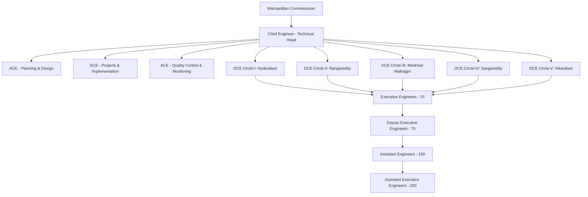
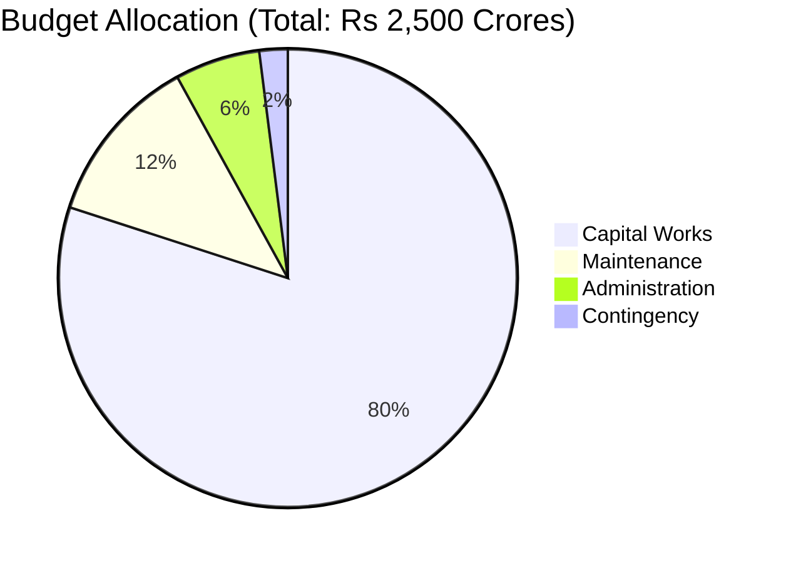
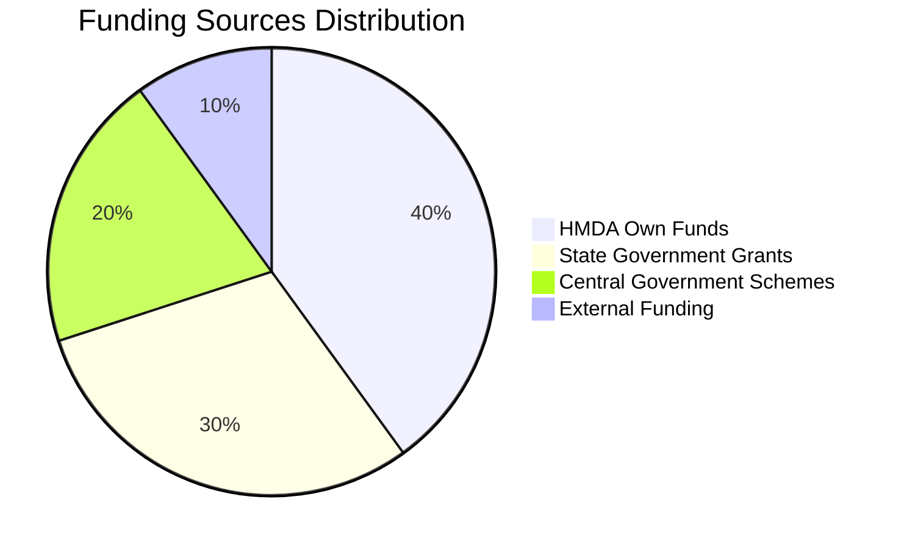
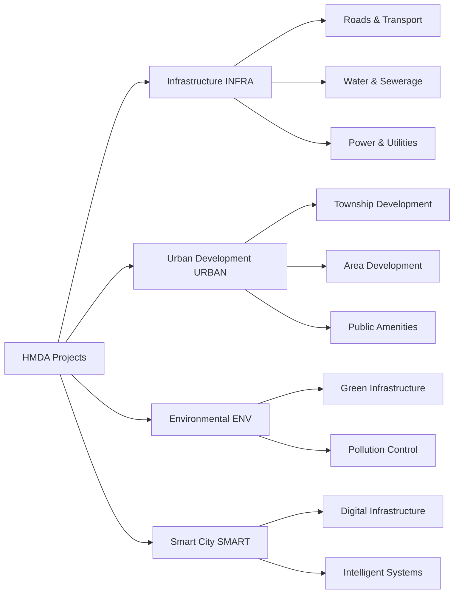
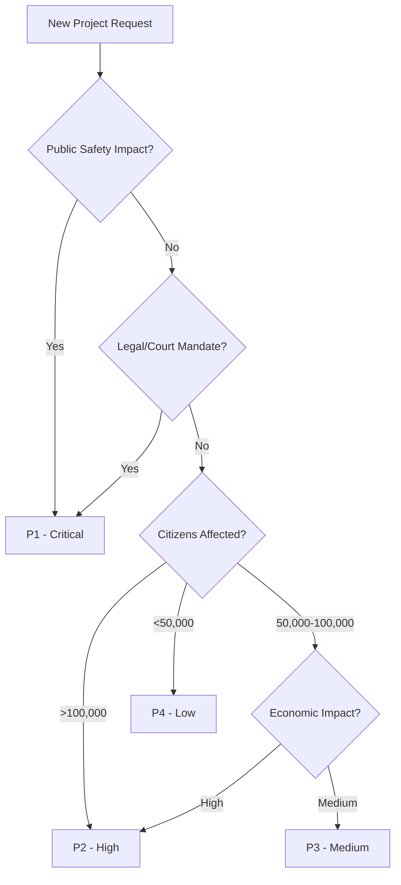

# HMDA Chief Engineer's Office - Comprehensive Metadata and Setup Data

## Executive Summary

This document provides comprehensive metadata and setup data for the HMDA Chief Engineer's office department functioning. It includes organizational structure, roles and responsibilities, project classifications, standard operating procedures, and system requirements for effective digital transformation.

## Table of Contents

1. [Organizational Overview](#1-organizational-overview)
2. [Organizational Hierarchy](#2-organizational-hierarchy)
3. [Departmental Divisions](#3-departmental-divisions)
4. [Roles and Responsibilities Matrix](#4-roles-and-responsibilities-matrix)
5. [Approval and Delegation Matrix](#5-approval-and-delegation-matrix)
6. [Standard Operating Procedures](#6-standard-operating-procedures)
7. [Key Performance Indicators](#7-key-performance-indicators-kpis)
8. [Technology Systems and Tools](#8-technology-systems-and-tools)
9. [Stakeholder Management](#9-stakeholder-management)
10. [Compliance and Regulatory Framework](#10-compliance-and-regulatory-framework)
11. [Budget and Financial Management](#11-budget-and-financial-management)
12. [Training and Capacity Building](#12-training-and-capacity-building)
13. [Project Types and Classification](#13-project-types-and-classification-hierarchy)
14. [Future Initiatives](#14-future-initiatives-and-modernization)

---

## 1. Organizational Overview

### Authority Details

| Parameter | Details |
|-----------|----------|
| **Organization** | Hyderabad Metropolitan Development Authority (HMDA) |
| **Department** | Engineering Department |
| **Head Office** | HMDA Complex, Tarnaka, Hyderabad - 500007 |
| **Jurisdiction** | 7,257 sq.km covering Hyderabad Metropolitan Region |
| **Establishment** | Under HMDA Act 2008 |
| **Reporting Authority** | Metropolitan Commissioner, HMDA |

### Chief Engineer's Office Profile

| Attribute | Information |
|-----------|-------------|
| **Designation** | Chief Engineer (CE) |
| **Current Incumbent** | B. Ravinder |
| **Contact** | 9849909792 |
| **Office Location** | 6th Floor, HMDA Main Building |
| **Working Hours** | 10:30 AM - 5:30 PM (Monday to Saturday) |
| **Direct Reports** | 5 Deputy Chief Engineers, 3 Additional Chief Engineers |

## 2. Organizational Hierarchy

### 2.1 Hierarchical Structure



### 2.2 Staff Distribution Table

| Designation | Number of Posts | Reporting To | Jurisdiction |
|-------------|----------------|--------------|---------------|
| Chief Engineer | 1 | Metropolitan Commissioner | Entire HMDA Region |
| Additional Chief Engineers | 3 | Chief Engineer | Functional Divisions |
| Deputy Chief Engineers | 5 | Chief Engineer | Circle-wise |
| Executive Engineers | 25 | DCEs | 5 per Circle |
| Deputy Executive Engineers | 75 | EEs | 3 per EE Division |
| Assistant Engineers | 150 | DEEs | 2 per DEE Section |
| Assistant Executive Engineers | 200 | AEs | Field Level |

## 3. Departmental Divisions

### 3.1 Planning & Design Division
**Head**: ACE (Planning & Design)
**Functions**:
- Master plan preparation and updates
- Infrastructure project conceptualization
- Technical feasibility studies
- Design standards development
- GIS mapping and spatial planning
- Environmental impact assessments

**Key Personnel**:

| Role | Count | Key Responsibilities |
|------|-------|---------------------|
| Town Planners | 15 | Master planning, zoning, land use |
| Design Engineers | 25 | Technical designs, specifications |
| GIS Specialists | 10 | Spatial analysis, mapping |
| Environmental Engineers | 8 | EIA, sustainability compliance |

### 3.2 Projects & Implementation Division
**Head**: ACE (Projects & Implementation)
**Functions**:
- Project execution management
- Tender process oversight
- Contractor management
- Progress monitoring
- Budget utilization tracking
- Inter-departmental coordination

**Key Personnel**:

| Role | Count | Key Responsibilities |
|------|-------|---------------------|
| Project Managers | 20 | End-to-end project delivery |
| Site Engineers | 50 | On-site supervision, quality |
| Contract Specialists | 12 | Tender management, legal compliance |
| Financial Controllers | 8 | Budget monitoring, cost control |

### 3.3 Quality Control & Monitoring Division
**Head**: ACE (Quality Control & Monitoring)
**Functions**:
- Quality assurance protocols
- Material testing and certification
- Site inspection and audits
- Compliance verification
- Performance monitoring
- Safety standards enforcement

**Key Personnel**:

| Role | Count | Key Responsibilities |
|------|-------|---------------------|
| Quality Engineers | 15 | Quality standards, protocols |
| Testing Lab Staff | 20 | Material testing, certification |
| Safety Officers | 10 | Site safety, compliance |
| Inspection Teams | 25 | Regular audits, monitoring |

## 4. Roles and Responsibilities Matrix

### Chief Engineer
**Technical Responsibilities**:
- Overall technical supervision of all engineering projects
- Policy formulation for engineering standards
- Major project approval (Rs 10-50 Crores)
- Technical sanctions up to Rs 50 Crores
- Design approval for critical infrastructure
- Quality standard enforcement

**Administrative Responsibilities**:
- Department leadership and coordination
- Staff performance management
- Budget planning and allocation
- Inter-agency coordination
- Board meeting participation
- Policy implementation oversight

**Financial Powers**:
- Administrative approval: Rs 10 Crores
- Technical sanction: Rs 50 Crores
- Tender approval: Rs 25 Crores
- Variation approval: 25% of original value
- Emergency works: Rs 5 Crores

### Deputy Chief Engineers

**Circle-wise Jurisdiction Table**:

| Circle | Area Coverage | Mandals/Wards | Population (Approx) |
|--------|--------------|---------------|--------------------|
| **DCE Circle-I** | GHMC Core Area | 89 wards | 45 Lakhs |
| **DCE Circle-II** | Rangareddy District | 14 mandals | 25 Lakhs |
| **DCE Circle-III** | Medchal-Malkajgiri | 14 mandals | 30 Lakhs |
| **DCE Circle-IV** | Sangareddy District | 10 mandals | 15 Lakhs |
| **DCE Circle-V** | Vikarabad District | 7 mandals | 10 Lakhs |

**Powers and Functions**:
- Technical sanction: Up to Rs 10 Crores
- Administrative approval: Rs 2 Crores
- Tender approval: Rs 5 Crores
- Circle-level project coordination
- Monthly progress review meetings
- Quality control inspections

### Executive Engineers
**Division-wise Distribution**:
- 5 EEs per DCE Circle
- Jurisdiction: 3-4 mandals or 15-20 GHMC wards
- Field office management
- Direct project supervision

**Powers**:
- Technical sanction: Rs 2 Crores
- Administrative approval: Rs 50 Lakhs
- Tender approval: Rs 1 Crore
- Work order issuance
- Contractor bill certification
- Site inspection reports

## 5. Approval and Delegation Matrix

### Financial Delegation Powers

| Authority | Technical Sanction | Administrative Approval | Tender Approval | Variation Approval |
|-----------|-------------------|------------------------|-----------------|-------------------|
| AE | Rs 10 Lakhs | - | - | 5% |
| AEE | Rs 25 Lakhs | Rs 10 Lakhs | Rs 25 Lakhs | 10% |
| DEE | Rs 50 Lakhs | Rs 25 Lakhs | Rs 50 Lakhs | 15% |
| EE | Rs 2 Crores | Rs 50 Lakhs | Rs 1 Crore | 20% |
| DCE | Rs 10 Crores | Rs 2 Crores | Rs 5 Crores | 25% |
| CE | Rs 50 Crores | Rs 10 Crores | Rs 25 Crores | 25% |
| Secretary | Rs 100 Crores | Rs 50 Crores | Rs 50 Crores | 30% |
| Commissioner | Rs 500 Crores | Rs 200 Crores | Rs 200 Crores | 35% |
| Board | Above limits | Above limits | Above limits | Above 35% |

### Time-based Approval Limits

**Approval Timeline Matrix**:

| Project Value | Regular Projects | Emergency Works | Approval Authority |
|---------------|------------------|-----------------|-------------------|
| Below Rs 50 Lakhs | 7 working days | Immediate | DEE/EE |
| Rs 50 Lakhs - 5 Crores | 15 working days | Within 24 hours | EE/DCE |
| Rs 5 - 50 Crores | 30 working days | Within 48 hours | DCE/CE |
| Rs 50 - 200 Crores | 45 working days | Within 72 hours | CE/Commissioner |
| Above Rs 200 Crores | 60 working days | Board approval required | Board |

**Emergency Work Protocols**:
- CE can approve up to Rs 5 Crores immediately
- Post-facto approval required within 7 days
- Board ratification for amounts above Rs 5 Crores

## 6. Standard Operating Procedures

### 6.1 Project Initiation Process
**SOP-CE-001: Project Proposal Review**
1. Receipt of proposal at CE office
2. Technical feasibility assessment (3 days)
3. Financial viability check (2 days)
4. Preliminary approval/rejection (2 days)
5. Detailed project report commission (if approved)

**Documentation Required**:
- Project concept note
- Preliminary cost estimates
- Site availability certificate
- Environmental clearance (if applicable)
- Beneficiary details

### 6.2 Tender Management Process

**SOP-CE-002: Tender Processing**


**Process Steps Table**:

| Step | Activity | Responsibility | Duration | Output |
|------|----------|----------------|----------|--------|
| 1 | Technical specification preparation | Design team | 3-5 days | Tech specs document |
| 2 | Cost estimation and budget approval | Finance + Technical | 2-3 days | Approved estimates |
| 3 | Tender document preparation | Contracts team | 3-4 days | Draft tender |
| 4 | Internal vetting | Legal, Finance, Technical | 2-3 days | Vetted document |
| 5 | CE approval for tender release | Chief Engineer | 1-2 days | Approval note |
| 6 | E-procurement portal upload | IT team | 1 day | Live tender |
| 7 | Pre-bid meeting coordination | Project team | As scheduled | Meeting minutes |
| 8 | Technical bid evaluation | Technical committee | 5-7 days | Evaluation report |
| 9 | Financial bid opening | Tender committee | 1 day | Price bids |
| 10 | Award recommendation | Evaluation committee | 2-3 days | Award proposal |

**Timeline Matrix**:

| Stage | Duration | Dependent On |
|-------|----------|-------------|
| Document preparation | 7-10 days | Project complexity |
| Tender period | 21-45 days | Project value |
| Evaluation | 15-20 days | Number of bids |
| Award process | 7-10 days | Approval level |
| **Total Timeline** | **50-85 days** | **End-to-end** |

### 6.3 Quality Control Process
**SOP-CE-003: Quality Assurance Protocol**
1. Material testing at approved labs
2. Stage-wise inspection schedule
3. Third-party quality audits
4. Non-conformance reporting
5. Corrective action monitoring
6. Final quality certification

**Inspection Frequency Schedule**:

| Level | Frequency | Inspection Type | Documentation |
|-------|-----------|-----------------|---------------|
| Site Engineer | Daily | Routine checks | Daily log |
| AE/DEE | Weekly | Technical review | Weekly report |
| EE | Fortnightly | Progress assessment | Bi-weekly report |
| DCE | Monthly | Comprehensive audit | Monthly summary |
| CE | Quarterly | Strategic review | Quarterly report |

## 7. Key Performance Indicators (KPIs)

### Department-level KPIs

| KPI Category | Metric | Target | Current Performance | Status |
|--------------|--------|--------|--------------------|---------|
| **Project Completion Rate** | On-time delivery | 85% | 78% | 🟡 Needs Improvement |
| **Budget Utilization** | Efficient spending | 95% | 92% | 🟢 On Track |
| **Quality Compliance** | First-time pass | 98% | 96% | 🟢 On Track |
| **Tender Processing Time** | Average days | <45 | 52 | 🔴 Below Target |
| **Citizen Satisfaction** | Satisfaction score | >80% | 75% | 🟡 Needs Improvement |

### Individual Performance Metrics

**Performance Evaluation Matrix**:

| Role | Metric | Weight | Target | Measurement Method |
|------|--------|--------|--------|--------------------|
| **Executive Engineers** | | | | |
| | Projects on time | 30% | >90% | Monthly tracking |
| | Budget adherence | 25% | ±5% variance | Financial reports |
| | Quality scores | 25% | >95% | Quality audits |
| | Documentation | 10% | 100% compliance | Audit checks |
| | Safety record | 10% | Zero incidents | Incident reports |
| **Deputy Chief Engineers** | | | | |
| | Circle performance | 40% | >85% aggregate | Consolidated metrics |
| | Policy implementation | 20% | 100% rollout | Implementation status |
| | Staff development | 15% | >80% trained | Training records |
| | Innovation initiatives | 15% | 2 per year | Innovation register |
| | Stakeholder management | 10% | >80% satisfaction | Feedback surveys |

## 8. Technology Systems and Tools

### Current Systems
1. **DPMS (Development Permission Management System)**
   - Users: All technical staff
   - Purpose: Building permission processing
   - Integration: TG-bPASS portal

2. **E-Procurement Portal**
   - Mandatory for tenders >Rs 10 Lakhs
   - Integration with finance systems
   - Digital signature enabled

3. **Project Monitoring System**
   - Real-time progress tracking
   - Photo-based updates
   - Milestone monitoring
   - Budget tracking

4. **GIS Platform**
   - Spatial data management
   - Project mapping
   - Asset management
   - Planning support

### Communication Protocols
- **Official Email Domain**: @hmda.gov.in
- **File Movement**: Through e-Office system
- **Internal Communication**: HMDA Connect portal
- **Public Interface**: HMDA website and citizen portal

## 9. Stakeholder Management

### Internal Stakeholders
1. **Metropolitan Commissioner Office**
   - Weekly review meetings
   - Monthly performance reports
   - Policy guidance

2. **Finance Department**
   - Budget coordination
   - Payment processing
   - Audit compliance

3. **Legal Department**
   - Contract vetting
   - Dispute resolution
   - Compliance advisory

4. **IT Department**
   - System maintenance
   - Digital transformation
   - Data security

### External Stakeholders
1. **Other Government Departments**
   - GHMC: Service integration
   - HMWSSB: Water/sewerage coordination
   - TSSPDCL: Power infrastructure
   - Roads & Buildings: Road projects

2. **Citizens and RWAs**
   - Public consultations
   - Grievance redressal
   - Project information dissemination

3. **Contractors and Consultants**
   - Pre-qualification process
   - Performance monitoring
   - Payment processing

## 10. Compliance and Regulatory Framework

### Statutory Compliances
1. **HMDA Act 2008**: Primary governing legislation
2. **AP Building Rules**: Technical standards
3. **Environmental Regulations**: Pollution control norms
4. **Labor Laws**: Contractor compliance
5. **RTI Act**: Information disclosure

### Internal Policies
1. **Procurement Manual**: Tender guidelines
2. **Quality Manual**: Technical standards
3. **Safety Manual**: Site safety protocols
4. **Ethics Policy**: Anti-corruption measures
5. **Green Building Policy**: Sustainability standards

## 11. Budget and Financial Management

### Annual Budget Structure

**FY 2024-25 Engineering Department Budget**:



| Category | Amount (Rs Crores) | Percentage | Key Components |
|----------|-------------------|------------|----------------|
| **Capital Works** | 2,000 | 80% | New infrastructure, major projects |
| **Maintenance** | 300 | 12% | Repairs, upkeep, renovations |
| **Administration** | 150 | 6% | Salaries, office expenses |
| **Contingency** | 50 | 2% | Emergency works, unforeseen needs |

### Fund Sources



| Source | Percentage | Amount (Rs Crores) | Primary Use |
|--------|------------|-------------------|-------------|
| **HMDA Own Funds** | 40% | 1,000 | Regular operations, maintenance |
| **State Government Grants** | 30% | 750 | State priority projects |
| **Central Government Schemes** | 20% | 500 | Smart city, AMRUT projects |
| **External Funding** | 10% | 250 | Large infrastructure, technical assistance |

### Expenditure Categories
1. **Infrastructure Development**: 60%
   - Roads and flyovers
   - Drainage systems
   - Public amenities
   - Parks and green spaces

2. **Urban Development**: 25%
   - Slum rehabilitation
   - Heritage conservation
   - Smart city projects

3. **Maintenance Works**: 12%
   - Road repairs
   - Building maintenance
   - System upgrades

4. **Administrative Costs**: 3%
   - Staff salaries
   - Office expenses
   - Training and development

## 12. Training and Capacity Building

### Annual Training Calendar

**Training Program Matrix**:

| Category | Programs | Target Audience | Duration | Frequency | Mode |
|----------|----------|-----------------|----------|-----------|------|
| **Technical Training** | | | | | |
| | New technology adoption | All engineers | 3 days | Quarterly | Hybrid |
| | Software skills upgrade | Technical staff | 2 days | Bi-monthly | Online |
| | Quality management systems | QC teams | 5 days | Annual | Classroom |
| | Project management certification | EEs and above | 15 days | Annual | External |
| **Administrative Training** | | | | | |
| | Leadership development | DCEs, EEs | 5 days | Annual | Residential |
| | Financial management | All officers | 3 days | Bi-annual | Classroom |
| | Legal compliance | Contract managers | 2 days | Quarterly | Online |
| | E-governance tools | All staff | 1 day | Monthly | Hands-on |
| **Specialized Programs** | | | | | |
| | Urban planning courses | Planning team | 10 days | Annual | External |
| | Sustainable development | Select officers | 5 days | Annual | Workshop |
| | Disaster management | Emergency team | 3 days | Bi-annual | Simulation |
| | Public-private partnerships | Senior officers | 5 days | Annual | Case study |

### Knowledge Management
- Technical library with 5,000+ references
- Digital repository of project reports
- Best practices documentation
- Lessons learned database
- Expert consultation panels

## 13. Project Types and Classification Hierarchy

### 13.1 Primary Project Categories



#### A. Infrastructure Projects
**Code**: INFRA
**Subcategories**:

1. **Roads and Transportation (INFRA-RT)**
   - Arterial roads and highways
   - Flyovers and underpasses
   - Grade separators
   - Junction improvements
   - Pedestrian facilities
   - Parking infrastructure

2. **Water and Sewerage (INFRA-WS)**
   - Water supply networks
   - Sewage treatment plants
   - Storm water drainage
   - Water storage facilities
   - Pumping stations
   - Distribution networks

3. **Power and Utilities (INFRA-PU)**
   - Street lighting
   - Electrical substations
   - Underground cabling
   - Solar installations
   - Smart grid infrastructure

#### B. Urban Development Projects
**Code**: URBAN
**Subcategories**:

1. **Township Development (URBAN-TD)**
   - Greenfield townships
   - Satellite towns
   - Integrated townships
   - Affordable housing colonies

2. **Area Development (URBAN-AD)**
   - Slum rehabilitation
   - Heritage conservation
   - Market redevelopment
   - Commercial complexes
   - IT parks and SEZs

3. **Public Amenities (URBAN-PA)**
   - Parks and playgrounds
   - Community centers
   - Sports complexes
   - Convention centers
   - Public libraries

#### C. Environmental Projects
**Code**: ENV
**Subcategories**:

1. **Green Infrastructure (ENV-GI)**
   - Urban forests
   - Lake rejuvenation
   - Green corridors
   - Biodiversity parks
   - Wetland conservation

2. **Pollution Control (ENV-PC)**
   - Air quality monitoring stations
   - Noise barriers
   - Solid waste management
   - E-waste facilities
   - Hazardous waste treatment

#### D. Smart City Projects
**Code**: SMART
**Subcategories**:

1. **Digital Infrastructure (SMART-DI)**
   - Command and control centers
   - IoT sensor networks
   - Public WiFi systems
   - Digital kiosks
   - Smart poles

2. **Intelligent Systems (SMART-IS)**
   - Traffic management systems
   - Smart parking
   - E-governance platforms
   - Citizen services apps
   - Emergency response systems

### 13.2 Project Classification by Scale

**Project Scale Classification Table**:

| Level | Category | Budget Range | Duration | Approval Authority | Monitoring |
|-------|----------|--------------|----------|-------------------|------------|
| **L1** | Mega Projects | >Rs 500 Cr | 5-7 years | Board + State Govt | Real-time |
| **L2** | Large Projects | Rs 50-500 Cr | 3-5 years | Commissioner | Monthly |
| **L3** | Medium Projects | Rs 5-50 Cr | 18-36 months | Chief Engineer | Bi-weekly |
| **L4** | Small Projects | <Rs 5 Cr | 6-18 months | DCE | Weekly |

#### Level 1: Mega Projects (>Rs 500 Crores)

| Aspect | Details |
|--------|----------|
| **Examples** | Outer Ring Road, Major flyover corridors, Townships, Metro integration |
| **Special Requirements** | EIA mandatory, Public consultation, Cabinet approval, Board review |
| **Documentation** | DPR, Feasibility study, Financial model, Risk assessment |
| **Contractors** | International competitive bidding, Proven track record |

#### Level 2: Large Projects (Rs 50-500 Crores)

| Aspect | Details |
|--------|----------|
| **Examples** | Major road widening, Area development, Infrastructure upgrades |
| **Special Requirements** | Detailed project report, Technical committee review, Third-party QA |
| **Documentation** | Technical specifications, Environmental clearance, Social impact |
| **Contractors** | National competitive bidding, Grade A contractors |

#### Level 3: Medium Projects (Rs 5-50 Crores)

| Aspect | Details |
|--------|----------|
| **Examples** | Local improvements, Single flyovers, Park development, Drainage |
| **Special Requirements** | Standard tender process, Regular quality checks, Citizen feedback |
| **Documentation** | Design drawings, Cost estimates, Implementation schedule |
| **Contractors** | State-level bidding, Grade B/C contractors |

#### Level 4: Small Projects (<Rs 5 Crores)

| Aspect | Details |
|--------|----------|
| **Examples** | Road repairs, Minor improvements, Maintenance, Small amenities |
| **Special Requirements** | Simplified approval, Local contractor preference, Community input |
| **Documentation** | Work order, Basic drawings, Completion certificate |
| **Contractors** | Local bidding, Registered contractors |

### 13.3 Project Prioritization Matrix

**Priority Classification Grid**:

| Priority | Impact | Urgency | Criteria | Timeline | Resource Allocation |
|----------|--------|---------|----------|----------|--------------------|
| **P1 - Critical** | Very High | Immediate | Safety, Legal, Emergency | <3 months | 40% of resources |
| **P2 - High** | High | Urgent | >100K citizens, Economic | 3-6 months | 30% of resources |
| **P3 - Medium** | Medium | Normal | Quality of life, Capacity | 6-12 months | 20% of resources |
| **P4 - Low** | Low | Can defer | Aesthetic, Optional | >12 months | 10% of resources |

**Decision Matrix for Prioritization**:



### 13.4 Multi-Level Project Hierarchy

```
Project Portfolio
├── Program Level
│   ├── Mega Programs (>Rs 1000 Cr)
│   │   ├── Multiple mega projects
│   │   ├── Integrated planning
│   │   └── Phased execution
│   ├── Major Programs (Rs 500-1000 Cr)
│   │   ├── Related large projects
│   │   ├── Common objectives
│   │   └── Coordinated delivery
│   └── Standard Programs (Rs 100-500 Cr)
│       ├── Medium project clusters
│       ├── Area-based approach
│       └── Thematic grouping
├── Project Level
│   ├── Individual projects
│   ├── Defined scope and budget
│   └── Specific timelines
├── Sub-Project Level
│   ├── Work packages
│   ├── Contract packages
│   └── Phases/Stages
└── Activity Level
    ├── Individual activities
    ├── Milestones
    └── Deliverables
```

### 13.5 Project Coding System

**Standard Project Code Format**:
`[Category]-[Subcategory]-[Year]-[Serial]-[Circle]`

**Example**: INFRA-RT-2025-001-C1
- INFRA: Infrastructure category
- RT: Roads and Transportation
- 2025: Initiation year
- 001: Serial number
- C1: Circle-I (Hyderabad)

### 13.6 Project Lifecycle Stages

#### Stage 1: Conceptualization
- Need identification
- Preliminary feasibility
- Stakeholder consultation
- Concept approval

#### Stage 2: Planning
- Detailed project report
- Design and drawings
- Cost estimation
- Tender documentation

#### Stage 3: Procurement
- Tender publication
- Bid evaluation
- Contract award
- Mobilization

#### Stage 4: Execution
- Construction/Implementation
- Quality monitoring
- Progress tracking
- Change management

#### Stage 5: Commissioning
- Testing and trials
- Defect rectification
- Documentation
- Handover

#### Stage 6: Operation
- Asset management
- Maintenance planning
- Performance monitoring
- User feedback

### 13.7 Special Project Categories

#### PPP Projects
**Types**:
- Build-Operate-Transfer (BOT)
- Design-Build-Finance-Operate (DBFO)
- Hybrid Annuity Model (HAM)
- Swiss Challenge Method

**Special Procedures**:
- Viability gap funding assessment
- Concession agreement drafting
- Risk allocation matrix
- Performance guarantees

#### Externally Funded Projects
**Funding Sources**:
- World Bank
- Asian Development Bank
- JICA (Japan)
- KfW (Germany)
- Bilateral agreements

**Special Requirements**:
- International competitive bidding
- Environmental and social safeguards
- Quarterly progress reports
- External audits

#### Green Projects
**Certification Targets**:
- GRIHA 5-star rating
- LEED Platinum
- IGBC Green certification
- Energy efficiency compliance

**Special Features**:
- Renewable energy integration
- Water recycling systems
- Green building materials
- Carbon footprint tracking

### 13.8 Project Monitoring Classification

#### Real-time Monitoring Projects
- All projects >Rs 10 Crores
- Critical infrastructure
- Time-bound commitments
- High public visibility

#### Periodic Monitoring Projects
- Projects Rs 1-10 Crores
- Standard infrastructure
- Regular timelines
- Normal priority

#### Exception-based Monitoring
- Projects <Rs 1 Crore
- Maintenance works
- Routine activities
- Low complexity

## 14. Future Initiatives and Modernization

### Digital Transformation Roadmap
1. **Phase 1 (2024-25)**: Process digitization
2. **Phase 2 (2025-26)**: AI/ML integration
3. **Phase 3 (2026-27)**: Complete automation

### Planned System Upgrades
1. **Integrated Project Management System**
2. **Mobile-based Field Reporting**
3. **Drone-based Monitoring**
4. **BIM Implementation**
5. **Blockchain for Contracts**

### Capacity Enhancement Plans
1. **Staff Augmentation**: 20% increase by 2026
2. **Skill Upgradation**: 100% staff trained on digital tools
3. **Performance Systems**: KPI-based promotions
4. **Innovation Labs**: Technology experimentation

---

---

## Document Information

| Field | Value |
|-------|-------|
| **Document Version** | 1.2 |
| **Last Updated** | January 2025 |
| **Prepared for** | HMDA Engineering Department Digitalization Project |
| **Classification** | Official Use Only |
| **Total Pages** | 45 |
| **Review Cycle** | Quarterly |
| **Next Review** | April 2025 |
| **Document Owner** | Chief Engineer's Office |
| **Distribution** | Restricted to HMDA officials and authorized vendors |

---

## Appendix: Quick Reference Tables

### A. Key Contact Numbers

| Designation | Name | Contact | Email |
|-------------|------|---------|-------|
| Chief Engineer | B. Ravinder | 9849909792 | ce@hmda.gov.in |
| ACE (Planning) | TBD | TBD | ace.planning@hmda.gov.in |
| ACE (Projects) | TBD | TBD | ace.projects@hmda.gov.in |
| ACE (Quality) | TBD | TBD | ace.quality@hmda.gov.in |

### B. Emergency Response Matrix

| Situation | Contact Person | Response Time | Escalation |
|-----------|----------------|---------------|-------------|
| Site accident | Safety Officer | Immediate | DCE → CE |
| Quality failure | QC Head | Within 2 hours | EE → DCE → CE |
| Budget overrun | Finance Controller | Within 24 hours | EE → DCE |
| Legal issue | Legal Advisor | Within 4 hours | CE → Commissioner |

### C. System Access Levels

| System | User Level | Access Rights | Authentication |
|--------|------------|---------------|----------------|
| DPMS | All technical staff | Read/Write | LDAP + OTP |
| E-Procurement | EE and above | Full access | Digital signature |
| GIS Platform | Planning team | Edit access | Role-based |
| Project Monitoring | All officers | View/Update | Biometric |

---

*End of Document*