# HMDA Project Lifecycle - 9 Stages Complete Documentation

## Executive Summary
This document presents the comprehensive 9-stage project lifecycle within HMDA Chief Engineer's office, demonstrating our complete understanding of end-to-end project execution from conceptualization to operations & maintenance.

## Table of Contents
1. [Stage 1: Project Conceptualization & Feasibility](#stage-1-project-conceptualization--feasibility)
2. [Stage 2: Detailed Project Report & Approvals](#stage-2-detailed-project-report--approvals)
3. [Stage 3: Tendering & Procurement](#stage-3-tendering--procurement)
4. [Stage 4: Contract Award & Mobilization](#stage-4-contract-award--mobilization)
5. [Stage 5: Construction/Execution Phase](#stage-5-constructionexecution-phase)
6. [Stage 6: Quality Control & Monitoring](#stage-6-quality-control--monitoring)
7. [Stage 7: Testing & Commissioning](#stage-7-testing--commissioning)
8. [Stage 8: Project Closure & Handover](#stage-8-project-closure--handover)
9. [Stage 9: Defect Liability & O&M Phase](#stage-9-defect-liability--om-phase)

---

## Stage 1: Project Conceptualization & Feasibility

### Duration: 3-6 months (varies by project size)

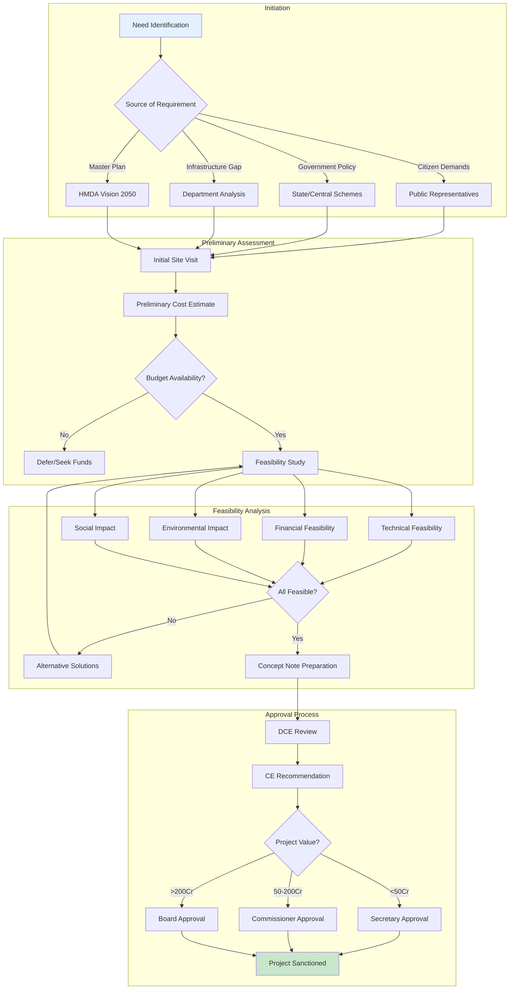

### Stage 1 Swimlane Diagram - Project Conceptualization Process:
```mermaid
flowchart LR
    subgraph Public["Public/Stakeholders"]
        A1[Raise Demand<br/>or Need]
        A2[Provide<br/>Feedback]
    end
    
    subgraph Field["Field Staff (AE/JE)"]
        B1[Site<br/>Investigation]
        B2[Initial<br/>Assessment]
        B3[Preliminary<br/>Estimate]
    end
    
    subgraph EE["Executive Engineer"]
        C1[Technical<br/>Review]
        C2[Feasibility<br/>Check]
        C3[Cost<br/>Validation]
        C4[Forward<br/>Proposal]
    end
    
    subgraph DCE["Deputy Chief Engineer"]
        D1[Department<br/>Review]
        D2[Priority<br/>Assessment]
        D3[Budget<br/>Verification]
        D4[Send<br/>Recommendation]
    end
    
    subgraph CE["Chief Engineer"]
        E1[Strategic<br/>Alignment]
        E2[Resource<br/>Planning]
        E3[Final<br/>Review]
        E4[Forward for<br/>Approval]
    end
    
    subgraph Higher["Higher Authorities"]
        F1[Secretary<br/>Review]
        F2[Commissioner<br/>Approval]
        F3[Board<br/>Sanction]
    end
    
    A1 --> B1
    A2 --> B2
    B1 --> B2
    B2 --> B3
    B3 --> C1
    C1 --> C2
    C2 --> C3
    C3 --> C4
    C4 --> D1
    D1 --> D2
    D2 --> D3
    D3 --> D4
    D4 --> E1
    E1 --> E2
    E2 --> E3
    E3 --> E4
    E4 --> F1
    F1 --> F2
    F2 --> F3
    
    style A1 fill:#e3f2fd,stroke:#1976d2,stroke-width:2px
    style F3 fill:#c8e6c9,stroke:#388e3c,stroke-width:2px
    style B1 fill:#fff3e0,stroke:#f57c00
    style B2 fill:#fff3e0,stroke:#f57c00
    style B3 fill:#fff3e0,stroke:#f57c00
    style C1 fill:#fff3e0,stroke:#f57c00
    style C2 fill:#fff3e0,stroke:#f57c00
    style C3 fill:#fff3e0,stroke:#f57c00
    style C4 fill:#fff3e0,stroke:#f57c00
    style D1 fill:#fff3e0,stroke:#f57c00
    style D2 fill:#fff3e0,stroke:#f57c00
    style D3 fill:#fff3e0,stroke:#f57c00
    style D4 fill:#fff3e0,stroke:#f57c00
    style E1 fill:#fff3e0,stroke:#f57c00
    style E2 fill:#fff3e0,stroke:#f57c00
    style E3 fill:#fff3e0,stroke:#f57c00
    style E4 fill:#fff3e0,stroke:#f57c00
```

### Key Documents Generated in Stage 1:
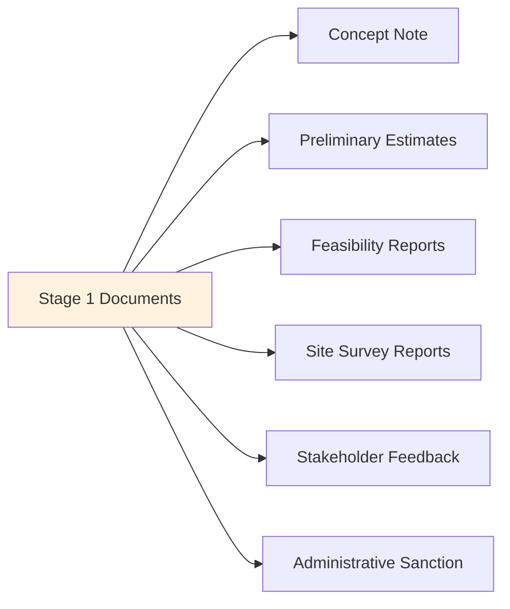

---

## Stage 2: Detailed Project Report & Approvals

### Duration: 4-8 months

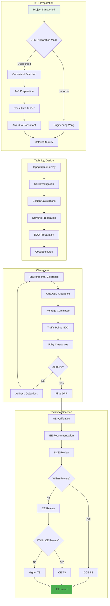

### Stage 2 Swimlane Diagram - DPR Preparation & Approval Process:
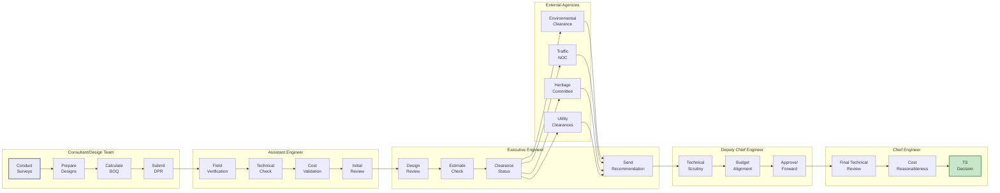

### Approval Matrix for Technical Sanction:
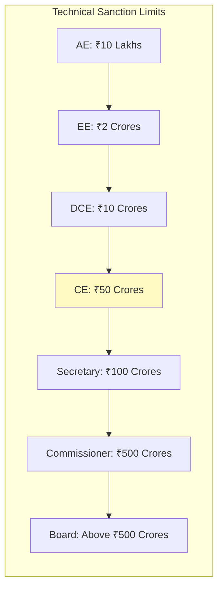

---

## Stage 3: Tendering & Procurement

### Duration: 2-4 months

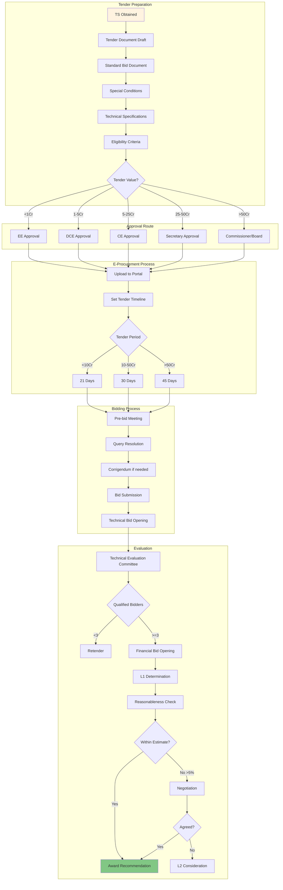

### Stage 3 Swimlane Diagram - Tendering & Procurement Process:
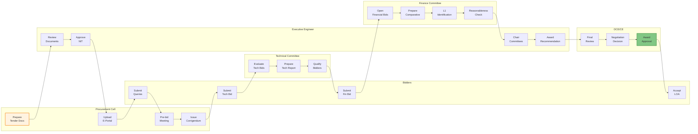

### Tender Timeline Matrix:
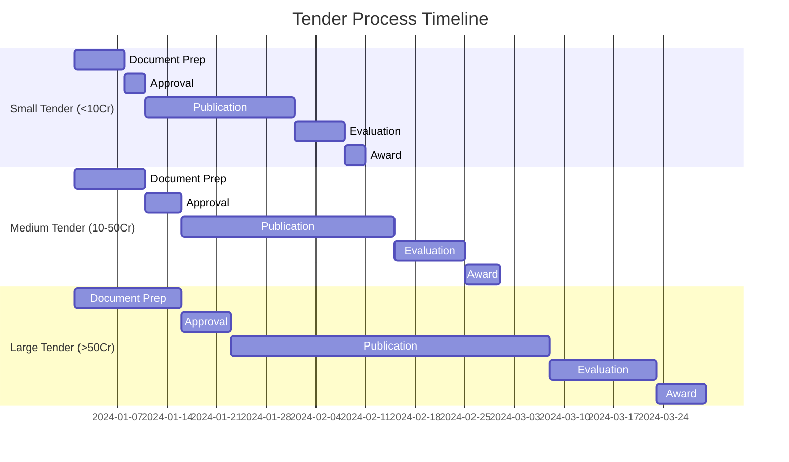

---

## Stage 4: Contract Award & Mobilization

### Duration: 1-2 months

```mermaid
flowchart TD
    subgraph Award Process
        A[L1 Identified] --> B[Award Recommendation]
        B --> C{Approval Level}
        C -->|As per Matrix| D[Competent Authority]
        D --> E[Award Approval]
        E --> F[Letter of Award - LOA]
    end
    
    subgraph Agreement Execution
        F --> G[LOA Acceptance]
        G --> H[Performance Security]
        H --> I{Security Amount}
        I -->|5% Contract| J[Bank Guarantee]
        I -->|Or FDR| K[Fixed Deposit]
        
        J --> L[Agreement Draft]
        K --> L
        L --> M[Stamp Duty Payment]
        M --> N[Agreement Signing]
        N --> O[Work Order Issue]
    end
    
    subgraph Site Mobilization
        O --> P[Site Handover]
        P --> Q[Joint Measurement]
        Q --> R[Site Layout Approval]
        R --> S[Mobilization Advance]
        S --> T{Advance Amount}
        T -->|10% Max| U[Against BG]
        T -->|15% Equipment| V[Equipment Advance]
        
        U --> W[Labour Deployment]
        V --> W
        W --> X[Material Procurement]
        X --> Y[Work Commencement]
    end
    
    subgraph Documentation
        Y --> Z[Commencement Certificate]
        Z --> AA[Site Order Book]
        AA --> AB[Measurement Book]
        AB --> AC[Hindrance Register]
        AC --> AD[Quality Register]
        AD --> AE[Stage Ready]
    end
    
    style F fill:#e3f2fd
    style Y fill:#c8e6c9
    style AE fill:#4caf50
```

### Stage 4 Swimlane Diagram - Contract Award & Mobilization:
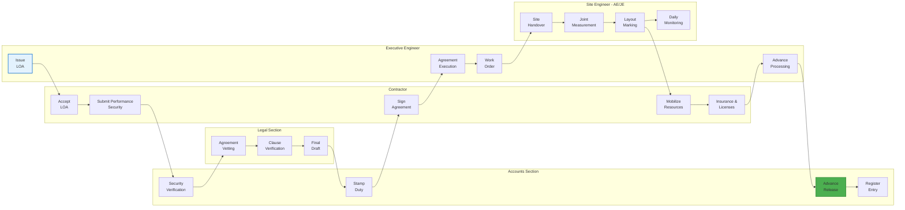

### Mobilization Checklist:
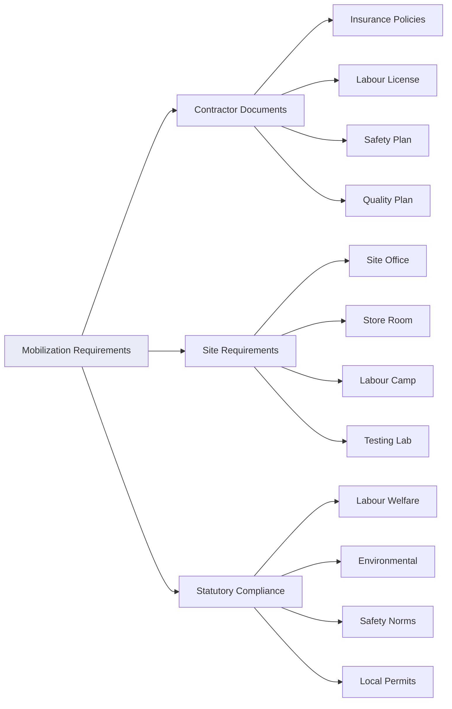

---

## Stage 5: Construction/Execution Phase

### Duration: 6-60 months (project dependent)

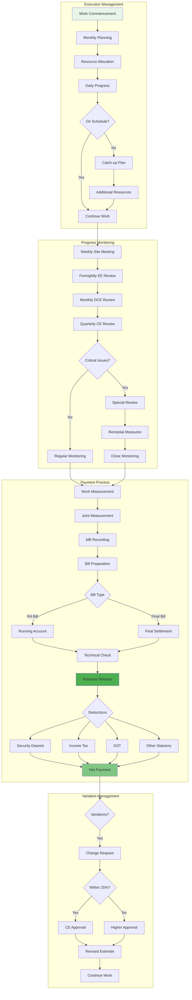

### Stage 5 Swimlane Diagram - Construction/Execution Phase:
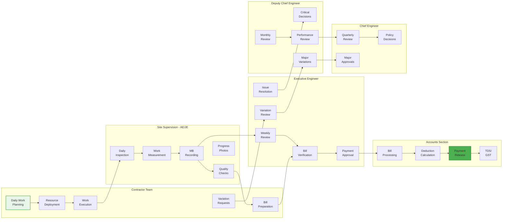

### Stage-wise Execution Tracking:
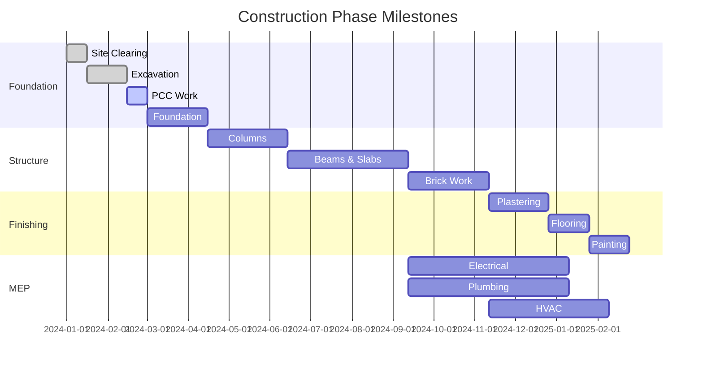

---

## Stage 6: Quality Control & Monitoring

### Duration: Continuous throughout execution

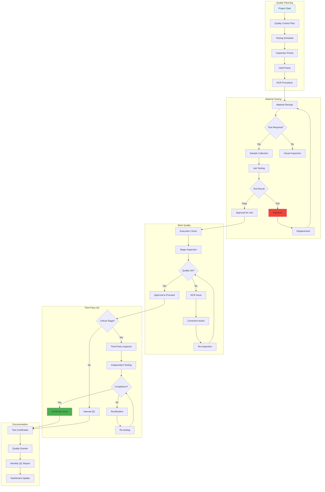

### Stage 6 Swimlane Diagram - Quality Control Process:
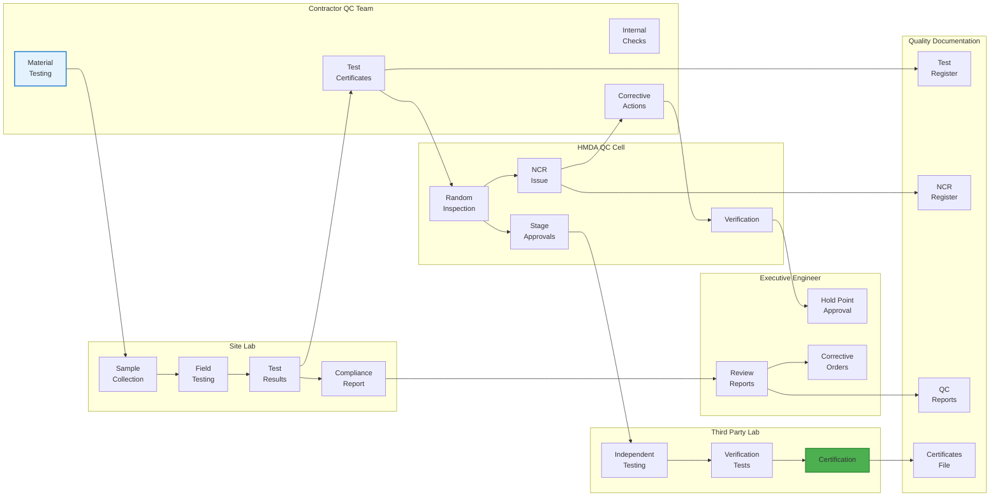

### Quality Control Matrix:
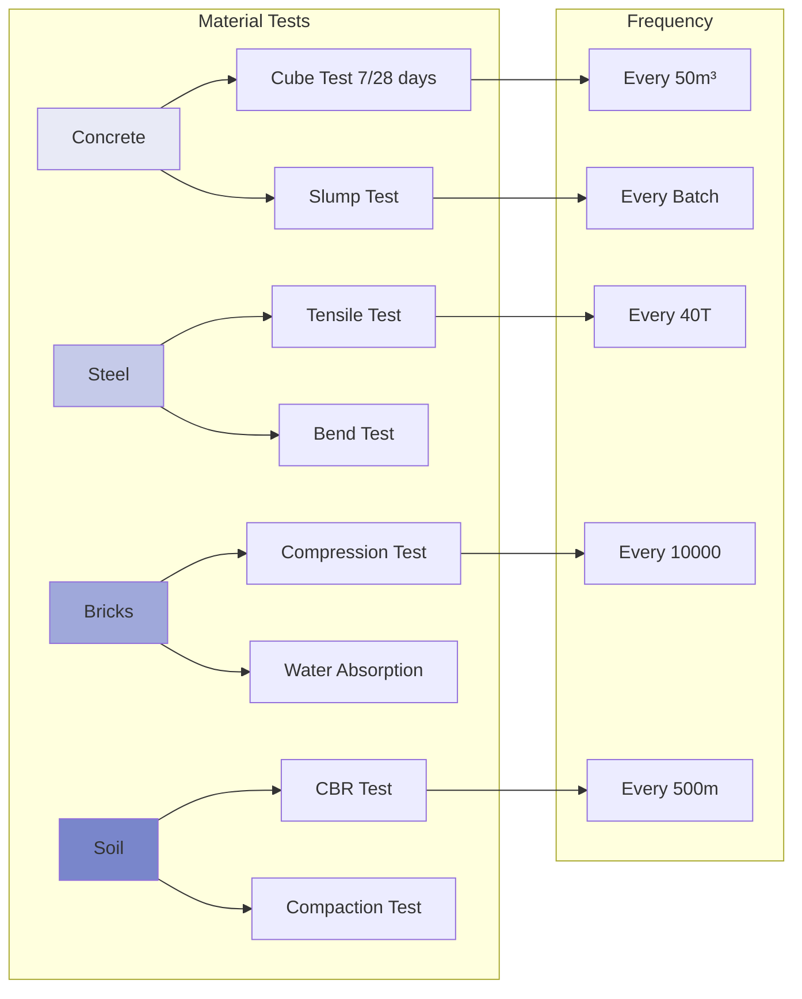

---

## Stage 7: Testing & Commissioning

### Duration: 1-3 months

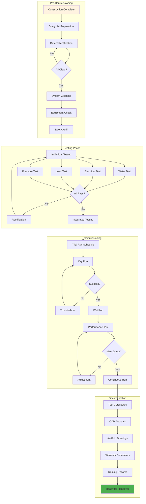

### Stage 7 Swimlane Diagram - Testing & Commissioning:
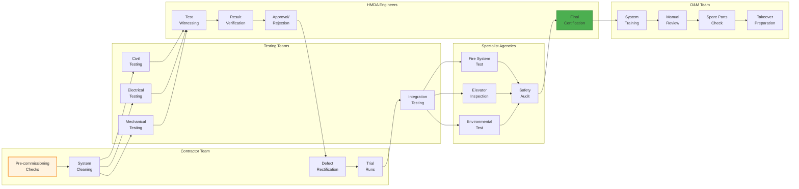

### Testing Checklist by System:
```mermaid
flowchart LR
    subgraph Civil Tests
        A[Structure] --> A1[Load Test]
        A --> A2[Waterproofing]
        A --> A3[Finishing Quality]
    end
    
    subgraph MEP Tests
        B[Electrical] --> B1[Insulation Test]
        B --> B2[Earth Test]
        B --> B3[Load Test]
        
        C[Plumbing] --> C1[Pressure Test]
        C --> C2[Leak Test]
        C --> C3[Flow Test]
        
        D[HVAC] --> D1[Temperature Test]
        D --> D2[Air Flow Test]
        D --> D3[Noise Level]
    end
    
    subgraph Special Tests
        E[Fire System] --> E1[Pump Test]
        E --> E2[Alarm Test]
        E --> E3[Sprinkler Test]
        
        F[Elevators] --> F1[Load Test]
        F --> F2[Safety Test]
        F --> F3[Speed Test]
    end
    
    style A fill:#e8f5e9
    style B fill:#fff9c4
    style E fill:#ffebee
```

---

## Stage 8: Project Closure & Handover

### Duration: 1-2 months

```mermaid
flowchart TD
    subgraph Completion Process
        A[Testing Complete] --> B[Joint Inspection]
        B --> C{Punch List}
        C -->|Items Found| D[Rectification]
        D --> E[Re-inspection]
        E --> C
        C -->|All Clear| F[Completion Certificate]
    end
    
    subgraph Documentation Handover
        F --> G[Document Compilation]
        G --> H[Technical Documents]
        H --> H1[As-built Drawings]
        H --> H2[Test Certificates]
        H --> H3[Warranties]
        H --> H4[O&M Manuals]
        
        G --> I[Financial Documents]
        I --> I1[Final Bill]
        I --> I2[Variation Statements]
        I --> I3[Material Reconciliation]
        I --> I4[Final Accounts]
    end
    
    subgraph Asset Transfer
        H4 --> J[Physical Handover]
        J --> K[Asset Register Entry]
        K --> L[Insurance Transfer]
        L --> M[Utility Connections]
        M --> N[Security Arrangements]
        N --> O[Maintenance Contract]
    end
    
    subgraph Stakeholder Handover
        O --> P{End User Type}
        P -->|Department| Q[Department Handover]
        P -->|Public Asset| R[Public Inauguration]
        P -->|Utility| S[Utility Agency]
        
        Q --> T[Training Program]
        R --> T
        S --> T
        T --> U[Handover Protocol]
        U --> V[Acceptance Certificate]
    end
    
    subgraph Financial Closure
        V --> W[Final Measurement]
        W --> X[Final Bill Process]
        X --> Y[Retention Release]
        Y --> Z[Performance BG Return]
        Z --> AA[Project Closed]
    end
    
    style A fill:#e3f2fd
    style F fill:#c8e6c9
    style V fill:#4caf50
    style AA fill:#2e7d32
```

### Stage 8 Swimlane Diagram - Project Closure & Handover:
```mermaid
flowchart LR
    subgraph Site["Site Team - AE/JE"]
        A1[Joint<br/>Inspection]
        A2[Snag List<br/>Prep]
        A3[Final<br/>Measurements]
        A4[Verify<br/>Completion]
    end
    
    subgraph Contractor["Contractor"]
        B1[Complete<br/>Punch List]
        B2[Submit<br/>Final Docs]
        B3[Final Bill<br/>Submission]
        B4[Training<br/>Delivery]
    end
    
    subgraph EE["Executive Engineer"]
        C1[Technical<br/>Verification]
        C2[Document<br/>Review]
        C3[Completion<br/>Certificate]
        C4[Final Bill<br/>Check]
    end
    
    subgraph EndUser["End User Department"]
        D1[Physical<br/>Inspection]
        D2[Training<br/>Receipt]
        D3[Asset<br/>Takeover]
        D4[Acceptance<br/>Sign-off]
    end
    
    subgraph Finance["Finance/Accounts"]
        E1[Final Account<br/>Prep]
        E2[Retention<br/>Calculation]
        E3[Security<br/>Release]
        E4[Asset<br/>Register]
    end
    
    subgraph CEOffice["Chief Engineer Office"]
        F1[Final<br/>Review]
        F2[Handover<br/>Approval]
        F3[Closure<br/>Order]
    end
    
    A1 --> A2
    A2 --> B1
    B1 --> A4
    A4 --> C1
    B2 --> C2
    C1 --> C3
    C2 --> C3
    B3 --> A3
    A3 --> C4
    C4 --> E1
    E1 --> E2
    C3 --> D1
    D1 --> B4
    B4 --> D2
    D2 --> D3
    D3 --> D4
    D4 --> F1
    E2 --> F2
    F1 --> F2
    F2 --> F3
    F3 --> E3
    E3 --> E4
    
    style A1 fill:#e3f2fd,stroke:#1976d2,stroke-width:2px
    style F3 fill:#4caf50,stroke:#388e3c,stroke-width:2px
    style E4 fill:#2e7d32,stroke:#1b5e20,stroke-width:2px
```

### Handover Documentation Checklist:
```mermaid
flowchart LR
    A[Handover Package] --> B[Technical Docs]
    B --> B1[As-built Drawings]
    B --> B2[Structural Drawings]
    B --> B3[MEP Drawings]
    B --> B4[Specifications]
    
    A --> C[Quality Docs]
    C --> C1[Test Certificates]
    C --> C2[Material Certs]
    C --> C3[Warranties]
    C --> C4[Guarantees]
    
    A --> D[O&M Docs]
    D --> D1[Operation Manual]
    D --> D2[Maintenance Schedule]
    D --> D3[Spare Parts List]
    D --> D4[Vendor Contacts]
    
    A --> E[Financial Docs]
    E --> E1[Final Account]
    E --> E2[Asset Value]
    E --> E3[Insurance Docs]
    E --> E4[AMC Details]
    
    style A fill:#e8eaf6
```

---

## Stage 9: Defect Liability & O&M Phase

### Duration: 12-60 months (as per contract)

```mermaid
flowchart TD
    subgraph Defect Liability Period
        A[Project Handover] --> B[DLP Starts]
        B --> C[Monthly Inspection]
        C --> D{Defects Found?}
        D -->|Yes| E[Defect Notice]
        D -->|No| F[Good Performance]
        
        E --> G[Contractor Intimation]
        G --> H{Response Time}
        H -->|Emergency| I[24 Hours]
        H -->|Urgent| J[7 Days]
        H -->|Routine| K[15 Days]
        
        I --> L[Rectification]
        J --> L
        K --> L
        L --> M[Verification]
        M --> N{Satisfactory?}
        N -->|No| O[Re-work]
        N -->|Yes| P[Close Defect]
        O --> L
    end
    
    subgraph Performance Monitoring
        F --> Q[Quarterly Review]
        P --> Q
        Q --> R[Performance Report]
        R --> S{DLP Status}
        S -->|6 Months| T[50% Security Release]
        S -->|12 Months| U[Full Security Release]
        S -->|Extended DLP| V[Partial Release]
    end
    
    subgraph O&M Transition
        U --> W[O&M Contract]
        W --> X{O&M Mode}
        X -->|In-house| Y[Department Team]
        X -->|Outsourced| Z[O&M Tender]
        X -->|Original Contractor| AA[Extended Contract]
        
        Y --> AB[O&M Manual]
        Z --> AB
        AA --> AB
        AB --> AC[Preventive Schedule]
        AC --> AD[Breakdown Protocol]
        AD --> AE[Performance KPIs]
    end
    
    subgraph Long-term Monitoring
        AE --> AF[Monthly Reports]
        AF --> AG[Annual Inspection]
        AG --> AH[Major Maintenance]
        AH --> AI[Budget Planning]
        AI --> AJ[Asset Life Management]
    end
    
    style A fill:#e3f2fd
    style U fill:#4caf50
    style AJ fill:#2e7d32
```

### Stage 9 Swimlane Diagram - DLP & O&M Phase:
```mermaid
flowchart LR
    subgraph EndUser["End User/Department"]
        A1[Defect<br/>Reporting]
        A2[Service<br/>Requests]
        A3[Feedback]
        A4[Annual<br/>Review]
    end
    
    subgraph HMDATeam["HMDA Maintenance Team"]
        B1[Defect<br/>Identification]
        B2[Notice<br/>Issue]
        B3[Work<br/>Verification]
        B4[Performance<br/>Review]
    end
    
    subgraph ContractorDLP["Contractor - DLP"]
        C1[Monthly<br/>Inspection]
        C2[Defect<br/>Rectification]
        C3[Emergency<br/>Response]
        C4[DLP Completion<br/>Report]
    end
    
    subgraph OMContractor["O&M Contractor"]
        D1[Preventive<br/>Maintenance]
        D2[Breakdown<br/>Service]
        D3[Spare Parts<br/>Mgmt]
        D4[Monthly<br/>Reports]
    end
    
    subgraph EE["Executive Engineer"]
        E1[DLP<br/>Monitoring]
        E2[Security Release<br/>Recommendation]
        E3[O&M Contract<br/>Mgmt]
        E4[Performance<br/>Evaluation]
    end
    
    subgraph Finance["Finance Section"]
        F1[Security<br/>Management]
        F2[50% Release<br/>6 months]
        F3[Full Release<br/>12 months]
        F4[O&M<br/>Payments]
    end
    
    A1 --> B1
    B1 --> B2
    B2 --> C1
    C1 --> C2
    C2 --> B3
    B3 --> B4
    C3 --> B3
    B4 --> E1
    E1 --> E2
    E2 --> F1
    F1 --> F2
    F2 --> F3
    C4 --> E2
    E3 --> D1
    D1 --> D4
    A2 --> D2
    D2 --> D3
    D4 --> E4
    A3 --> A4
    A4 --> E4
    E4 --> F4
    
    style A1 fill:#ffebee,stroke:#d32f2f,stroke-width:2px
    style F3 fill:#4caf50,stroke:#388e3c,stroke-width:2px
    style D1 fill:#e8f5e9,stroke:#4caf50,stroke-width:2px
```

### DLP & O&M Timeline:
```mermaid
gantt
    title Defect Liability & O&M Period
    dateFormat  YYYY-MM-DD
    section DLP Phase
    Initial Period      :done, dlp1, 2024-01-01, 180d
    50% Security Release:milestone, after dlp1
    Extended Period     :active, dlp2, after dlp1, 180d
    Full Security Release:milestone, after dlp2
    
    section O&M Phase
    Transition Period   :om1, after dlp2, 30d
    Year 1 O&M         :om2, after om1, 335d
    Year 2 O&M         :om3, after om2, 365d
    Year 3 O&M         :om4, after om3, 365d
    Major Maintenance   :om5, after om4, 60d
    
    section Reviews
    Quarterly Review 1  :milestone, 2024-03-31
    Quarterly Review 2  :milestone, 2024-06-30
    Annual Review      :milestone, 2024-12-31
```

---

## Integrated 9-Stage Overview

```mermaid
flowchart LR
    subgraph Project Lifecycle
        A[Stage 1<br/>Conceptualization<br/>3-6 months] --> B[Stage 2<br/>DPR & Approvals<br/>4-8 months]
        B --> C[Stage 3<br/>Tendering<br/>2-4 months]
        C --> D[Stage 4<br/>Award & Mobilization<br/>1-2 months]
        D --> E[Stage 5<br/>Construction<br/>6-60 months]
        E --> F[Stage 6<br/>Quality Control<br/>Continuous]
        E --> G[Stage 7<br/>Testing<br/>1-3 months]
        G --> H[Stage 8<br/>Handover<br/>1-2 months]
        H --> I[Stage 9<br/>DLP & O&M<br/>12-60 months]
    end
    
    style A fill:#e3f2fd
    style E fill:#fff3e0
    style F fill:#ffebee
    style I fill:#e8f5e9
```

---

## Key Success Metrics Across 9 Stages

```mermaid
flowchart TD
    subgraph Stage Metrics
        A[Conceptualization] --> A1[Need Assessment Accuracy]
        B[DPR] --> B1[Design Completeness]
        C[Tendering] --> C1[Competitive Bidding]
        D[Award] --> D1[Mobilization Speed]
        E[Construction] --> E1[Schedule Adherence]
        F[Quality] --> F1[First-time Pass Rate]
        G[Testing] --> G1[System Performance]
        H[Handover] --> H1[Snag-free Completion]
        I[O&M] --> I1[Asset Reliability]
    end
    
    subgraph KPIs
        A1 --> K1[>90% Stakeholder Agreement]
        B1 --> K2[<5% Design Changes]
        C1 --> K3[>3 Qualified Bidders]
        D1 --> K4[<30 Days Mobilization]
        E1 --> K5[>85% On-time Delivery]
        F1 --> K6[>95% Quality Pass]
        G1 --> K7[100% Performance Specs]
        H1 --> K8[<10 Snag Items]
        I1 --> K9[>98% Uptime]
    end
    
    style K5 fill:#4caf50
    style K7 fill:#2e7d32
    style K9 fill:#1b5e20
```

---

## Document Control & Tracking

This comprehensive 9-stage documentation demonstrates:

1. **Complete Lifecycle Understanding**: From concept to long-term O&M
2. **Detailed Process Knowledge**: Every approval, test, and milestone
3. **Timeline Awareness**: Realistic durations for each stage
4. **Quality Integration**: Embedded at every stage, not just Stage 6
5. **Financial Control**: Payment milestones and security management
6. **Risk Management**: Hold points and verification gates
7. **Stakeholder Management**: Clear roles and responsibilities
8. **Documentation Rigor**: Complete audit trail maintenance
9. **Performance Tracking**: KPIs for continuous improvement

---

*Prepared for HMDA Chief Engineer B. Ravinder to demonstrate comprehensive project lifecycle expertise*