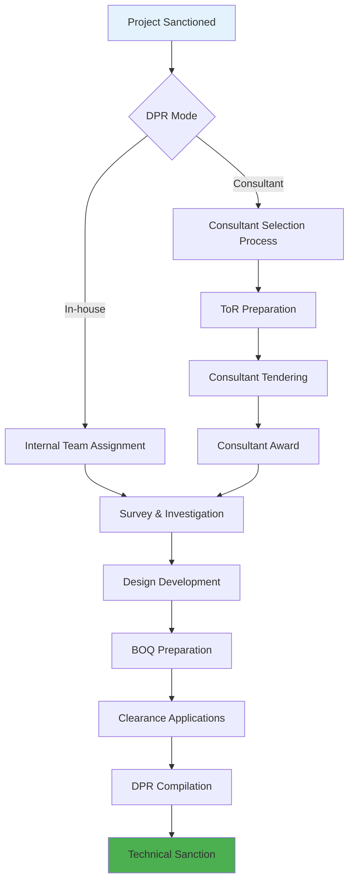

# HMDA Project Stage 2: Overview & Global Design System
## Detailed Project Report & Approvals - Foundation Document

---

## Executive Summary

This document establishes the foundation for Stage 2 (Detailed Project Report & Approvals) UI/UX design, covering the comprehensive design system, business context, and technical architecture. Stage 2 is the most technically complex phase, involving detailed engineering, design work, external consultants, and multiple approval workflows.

**Duration**: 4-8 months  
**Key Outcome**: Technical Sanction (TS) approval for project execution  
**Primary Users**: Engineering teams, Consultants, External agencies, Approval authorities

---

## Table of Contents

1. [Stage 2 Business Context](#1-stage-2-business-context)
2. [Process Flow Overview](#2-process-flow-overview)
3. [User Roles & Personas](#3-user-roles--personas)
4. [Global Design System](#4-global-design-system)
5. [Screen Architecture](#5-screen-architecture)
6. [Data Models](#6-data-models)
7. [Workflow Configuration](#7-workflow-configuration)
8. [Integration Framework](#8-integration-framework)
9. [Security & Compliance](#9-security--compliance)
10. [Performance Requirements](#10-performance-requirements)

---

## 1. Stage 2 Business Context

### 1.1 Stage 2 Objectives
- **Primary Goal**: Convert approved concept into detailed engineering design
- **Technical Goal**: Create complete DPR with all technical specifications
- **Regulatory Goal**: Obtain all required clearances and approvals
- **Quality Goal**: Ensure 100% accuracy in design and estimates

### 1.2 Key Deliverables
1. **Detailed Survey Reports**
   - Topographic survey
   - Soil investigation
   - Utility mapping
   - Environmental assessment

2. **Engineering Designs**
   - Architectural drawings
   - Structural designs
   - MEP (Mechanical, Electrical, Plumbing) drawings
   - Landscape plans

3. **Detailed Estimates**
   - Bill of Quantities (BOQ)
   - Material specifications
   - Labour requirements
   - Equipment needs

4. **Regulatory Clearances**
   - Environmental clearance
   - Fire NOC
   - Traffic police permission
   - Utility clearances

5. **Technical Sanction**
   - Complete DPR document
   - Technical approval
   - Cost approval
   - Implementation authorization

### 1.3 Critical Success Factors
- **Accuracy**: Zero tolerance for technical errors
- **Compliance**: 100% regulatory adherence
- **Timeline**: Strict milestone adherence
- **Quality**: Professional-grade deliverables
- **Coordination**: Seamless multi-party collaboration

---

## 2. Process Flow Overview

### 2.1 Stage 2 Sub-processes



### 2.2 Parallel Work Streams

| Stream | Activities | Duration | Dependencies |
|--------|------------|----------|--------------|
| **Survey** | Topographic, Soil, Utility mapping | 2-4 weeks | Site access, Weather |
| **Design** | Architectural, Structural, MEP | 8-12 weeks | Survey completion |
| **Clearances** | Environmental, Fire, Traffic | 4-16 weeks | Design progress |
| **Estimates** | BOQ, Cost analysis | 2-4 weeks | Design completion |
| **Documentation** | DPR assembly, Review | 2-3 weeks | All inputs ready |

### 2.3 Decision Points

1. **DPR Mode Selection**: In-house vs Consultant
2. **Design Approval**: Technical design sign-off
3. **Cost Approval**: Estimate validation
4. **Clearance Strategy**: Sequential vs Parallel processing
5. **Technical Sanction**: Final approval decision

---

## 3. User Roles & Personas

### 3.1 Internal HMDA Roles

| Role | Responsibilities | Stage 2 Focus |
|------|------------------|---------------|
| **CE** | Strategic oversight, Final TS approval | Policy compliance, Resource allocation |
| **DCE** | Technical leadership, Quality assurance | Design review, Consultant management |
| **EE** | Project management, Coordination | Daily oversight, Progress monitoring |
| **AE** | Technical execution, Site supervision | Survey supervision, Drawing review |
| **JE** | Field work, Data collection | Survey execution, Site documentation |

### 3.2 External Stakeholders

| Role | Organization | Responsibilities |
|------|--------------|------------------|
| **Design Consultant** | Private firm | Complete DPR preparation |
| **Survey Agency** | Specialized firm | Topographic & soil investigation |
| **Environmental Consultant** | EIA specialist | Environmental clearance |
| **Structural Engineer** | Licensed professional | Structural design certification |
| **MEP Consultant** | Technical specialist | Services design |

### 3.3 Approval Authorities

| Authority | Scope | Typical Timeline |
|-----------|-------|------------------|
| **HMDA Technical Cell** | Internal design review | 5-7 days |
| **Environmental Dept** | Environmental clearance | 30-60 days |
| **Fire Department** | Fire NOC | 15-21 days |
| **Traffic Police** | Traffic impact assessment | 7-14 days |
| **Utility Agencies** | Service connections | 14-30 days |

---

## 4. Global Design System

### 4.1 Extended Color Palette

```css
/* Stage 2 Specific Colors */
:root {
  /* Primary Brand Colors (inherited from Stage 1) */
  --hmda-primary: #1e3a8a;
  --hmda-secondary: #059669;
  --hmda-alert: #dc2626;
  --hmda-warning: #f59e0b;
  
  /* Stage 2 Specific Colors */
  --technical-blue: #2563eb;    /* Technical drawings, CAD */
  --consultant-purple: #7c3aed; /* External consultant activities */
  --approval-green: #16a34a;    /* Clearances, approvals */
  --drawing-orange: #ea580c;    /* Design and drawing management */
  --survey-teal: #0d9488;       /* Survey and investigation */
  
  /* Status Colors */
  --draft-gray: #6b7280;
  --inprogress-blue: #3b82f6;
  --review-orange: #f97316;
  --approved-green: #22c55e;
  --rejected-red: #ef4444;
  
  /* Background Variations */
  --bg-technical: #f0f9ff;      /* Technical sections */
  --bg-consultant: #faf5ff;     /* Consultant areas */
  --bg-approval: #f0fdf4;       /* Approval workflows */
}
```

### 4.2 Typography System

```css
/* Technical Documentation Fonts */
.technical-text {
  font-family: 'Roboto Mono', 'Courier New', monospace;
  font-size: 14px;
  line-height: 1.5;
  letter-spacing: 0.025em;
}

.drawing-label {
  font-family: 'Arial', sans-serif;
  font-size: 12px;
  font-weight: 600;
  text-transform: uppercase;
  letter-spacing: 0.1em;
}

.dimension-text {
  font-family: 'Roboto', sans-serif;
  font-size: 11px;
  font-weight: 500;
  color: var(--technical-blue);
}
```

### 4.3 Component Library Extensions

#### 4.3.1 Technical Components
- **Drawing Viewer**: CAD file display with zoom, pan, measure tools
- **BOQ Table**: Specialized table for quantities with calculations
- **Progress Timeline**: Visual project milestone tracking
- **Clearance Tracker**: Status visualization for multiple approvals
- **File Version Manager**: Document version control interface
- **Consultant Portal**: External user interface components

#### 4.3.2 Specialized Form Controls
- **Technical Input Fields**: Precision number inputs with units
- **Drawing Upload**: CAD file upload with format validation
- **Specification Builder**: Dynamic technical specification forms
- **Approval Workflow**: Multi-step approval interface
- **Comment Threading**: Hierarchical comment system for reviews

### 4.4 Icon System

```javascript
const stage2Icons = {
  // Process Icons
  survey: 'map-pin',
  design: 'drafting-compass',
  drawing: 'file-text',
  boq: 'calculator',
  clearance: 'shield-check',
  approval: 'stamp',
  
  // File Type Icons
  dwg: 'file-cad',
  pdf: 'file-pdf',
  excel: 'file-excel',
  image: 'file-image',
  
  // Status Icons
  pending: 'clock',
  inProgress: 'loader',
  completed: 'check-circle',
  approved: 'shield-check',
  rejected: 'x-circle',
  
  // Action Icons
  review: 'eye',
  edit: 'edit-3',
  download: 'download',
  upload: 'upload',
  share: 'share-2'
};
```

---

## 5. Screen Architecture

### 5.1 Navigation Structure

```
Stage 2: DPR & Approvals
├── DPR Overview Dashboard
├── Consultant Management
│   ├── Selection Process
│   ├── Contract Management
│   └── Performance Tracking
├── Survey & Investigation
│   ├── Survey Planning
│   ├── Data Collection
│   └── Report Management
├── Design Development
│   ├── Drawing Management
│   ├── Specification Builder
│   └── Design Review
├── BOQ & Estimates
│   ├── Quantity Takeoff
│   ├── Rate Analysis
│   └── Cost Computation
├── Clearances & NOCs
│   ├── Application Tracking
│   ├── Document Management
│   └── Status Dashboard
├── Technical Sanction
│   ├── DPR Assembly
│   ├── Review Workflow
│   └── Approval Tracking
└── Reports & Analytics
    ├── Progress Reports
    ├── Cost Analysis
    └── Timeline Tracking
```

### 5.2 Screen Categorization

| Category | Screens | Complexity | Users |
|----------|---------|------------|-------|
| **Management** | Dashboard, Overview | Medium | All roles |
| **Consultant** | Selection, Contract, Portal | High | EE, DCE, Consultants |
| **Technical** | Survey, Design, BOQ | Very High | Technical teams |
| **Regulatory** | Clearances, NOCs | Medium | Approval teams |
| **Documentation** | DPR Assembly, Review | High | Documentation teams |

### 5.3 Responsive Design Strategy

#### 5.3.1 Desktop-First Approach
- Primary interface optimized for large screens
- CAD viewing requires minimum 1920x1080 resolution
- Dual monitor support for drawings and data entry
- High-resolution display support for technical drawings

#### 5.3.2 Tablet Adaptation
- Site supervision interface for tablets
- Optimized forms for field data collection
- Touch-friendly drawing markup tools
- Offline capability for field work

#### 5.3.3 Mobile Considerations
- Limited to dashboard views and approvals
- Photography and basic data entry
- Progress tracking and notifications
- Quick approval actions

---

## 6. Data Models

### 6.1 Core Data Structures

#### 6.1.1 DPR Project Model
```javascript
interface DPRProject {
  dprId: string;
  projectId: string; // Link to Stage 1
  dprMode: 'IN_HOUSE' | 'CONSULTANT';
  status: 'INITIATED' | 'SURVEY_PHASE' | 'DESIGN_PHASE' | 'CLEARANCE_PHASE' | 'DOCUMENTATION' | 'TS_PENDING' | 'COMPLETED';
  
  // Consultant Information
  consultant?: {
    id: string;
    name: string;
    contractValue: number;
    startDate: Date;
    endDate: Date;
    performanceRating: number;
  };
  
  // Technical Team
  technicalTeam: {
    projectManager: string;
    designLead: string;
    surveyLead: string;
    qualityManager: string;
  };
  
  // Deliverables
  deliverables: {
    surveyReports: FileReference[];
    drawings: DrawingSet[];
    boq: BOQDocument;
    specifications: TechnicalSpec[];
    clearances: ClearanceStatus[];
  };
  
  // Progress Tracking
  milestones: Milestone[];
  timeline: ProjectTimeline;
  budget: BudgetTracking;
}
```

#### 6.1.2 Drawing Management Model
```javascript
interface DrawingSet {
  setId: string;
  category: 'ARCHITECTURAL' | 'STRUCTURAL' | 'MEP' | 'LANDSCAPE' | 'SURVEY';
  drawings: Drawing[];
  
  // Version Control
  currentVersion: string;
  versionHistory: DrawingVersion[];
  
  // Review Status
  reviewStatus: ReviewStatus;
  approvals: ApprovalRecord[];
}

interface Drawing {
  drawingId: string;
  title: string;
  drawingNumber: string;
  scale: string;
  size: 'A0' | 'A1' | 'A2' | 'A3' | 'A4';
  format: 'DWG' | 'PDF' | 'DXF';
  
  // File Information
  filePath: string;
  fileSize: number;
  checksum: string;
  
  // Metadata
  drawnBy: string;
  checkedBy: string;
  approvedBy: string;
  dateCreated: Date;
  lastModified: Date;
  
  // Relationships
  referencedDrawings: string[];
  specifications: string[];
}
```

#### 6.1.3 BOQ Model
```javascript
interface BOQDocument {
  boqId: string;
  projectId: string;
  version: string;
  
  // Structure
  sections: BOQSection[];
  summary: BOQSummary;
  
  // Metadata
  preparedBy: string;
  checkedBy: string;
  approvedBy: string;
  dateCreated: Date;
  
  // Calculations
  totalQuantity: number;
  totalCost: number;
  contingency: number;
  taxes: number;
  grandTotal: number;
}

interface BOQSection {
  sectionId: string;
  title: string;
  items: BOQItem[];
  subtotal: number;
}

interface BOQItem {
  itemId: string;
  description: string;
  unit: string;
  quantity: number;
  rate: number;
  amount: number;
  
  // Rate Analysis
  rateSource: 'SOR' | 'MARKET' | 'CUSTOM';
  sorCode?: string;
  rateJustification?: string;
  
  // Specifications
  specifications: string[];
  drawings: string[];
}
```

---

## 7. Workflow Configuration

### 7.1 DPR Workflow States

```javascript
const dprWorkflow = {
  states: [
    {
      name: 'INITIATED',
      description: 'DPR process started',
      nextStates: ['CONSULTANT_SELECTION', 'IN_HOUSE_ASSIGNMENT'],
      requiredActions: ['mode_selection'],
      sla: 3 // days
    },
    {
      name: 'CONSULTANT_SELECTION',
      description: 'Consultant selection in progress',
      nextStates: ['CONSULTANT_APPOINTED', 'IN_HOUSE_ASSIGNMENT'],
      requiredActions: ['tor_preparation', 'tender_process', 'award'],
      sla: 45 // days
    },
    {
      name: 'SURVEY_PHASE',
      description: 'Survey and investigation ongoing',
      nextStates: ['DESIGN_PHASE'],
      requiredActions: ['topographic_survey', 'soil_investigation', 'utility_mapping'],
      sla: 30 // days
    },
    {
      name: 'DESIGN_PHASE',
      description: 'Engineering design in progress',
      nextStates: ['CLEARANCE_PHASE'],
      requiredActions: ['drawings_completion', 'specifications', 'boq_preparation'],
      sla: 90 // days
    },
    {
      name: 'CLEARANCE_PHASE',
      description: 'Regulatory clearances processing',
      nextStates: ['DOCUMENTATION'],
      requiredActions: ['environmental_clearance', 'fire_noc', 'traffic_clearance'],
      sla: 60 // days
    },
    {
      name: 'DOCUMENTATION',
      description: 'DPR compilation and review',
      nextStates: ['TS_PENDING'],
      requiredActions: ['dpr_assembly', 'internal_review', 'quality_check'],
      sla: 15 // days
    },
    {
      name: 'TS_PENDING',
      description: 'Technical sanction approval pending',
      nextStates: ['COMPLETED', 'REVISION_REQUIRED'],
      requiredActions: ['technical_review', 'cost_approval', 'final_sanction'],
      sla: 21 // days
    }
  ]
};
```

### 7.2 Approval Hierarchies

#### 7.2.1 Technical Sanction Matrix
| Project Value | Technical Review | Cost Approval | Final Sanction |
|---------------|-----------------|---------------|----------------|
| < ₹10 Lakhs | AE | EE | EE |
| ₹10L - ₹2 Cr | EE | DCE | DCE |
| ₹2 - ₹10 Cr | DCE | CE | CE |
| ₹10 - ₹50 Cr | CE | Secretary | Secretary |
| ₹50 - ₹200 Cr | CE | Commissioner | Commissioner |
| > ₹200 Cr | CE | Board | Board |

#### 7.2.2 Drawing Approval Chain
1. **Preparation**: Consultant/Internal team
2. **Technical Check**: AE/JE (calculations, standards)
3. **Design Review**: EE (design adequacy, feasibility)
4. **Final Approval**: DCE/CE (based on value)

---

## 8. Integration Framework

### 8.1 CAD Integration

#### 8.1.1 Supported CAD Formats
- **AutoCAD**: .dwg, .dxf (primary)
- **MicroStation**: .dgn
- **SketchUp**: .skp (3D models)
- **PDF**: Vector-based technical drawings

#### 8.1.2 CAD Viewer Requirements
```javascript
const cadViewer = {
  features: [
    'pan_zoom',
    'layer_control',
    'measurement_tools',
    'markup_annotation',
    'print_to_scale',
    'file_comparison'
  ],
  performance: {
    maxFileSize: '100MB',
    loadTime: '<5 seconds',
    smoothPanning: '60fps',
    zoomLevels: '1:1 to 1:10000'
  },
  browser: {
    webgl: 'required',
    memory: '4GB recommended',
    gpu: 'dedicated preferred'
  }
};
```

### 8.2 Document Management Integration

#### 8.2.1 File Storage Strategy
```javascript
const storageStrategy = {
  drawings: {
    location: 'secure_cloud_storage',
    backup: 'multiple_regions',
    versioning: 'full_history',
    access: 'role_based'
  },
  documents: {
    location: 'document_management_system',
    search: 'full_text_indexed',
    workflow: 'approval_routing',
    retention: 'project_lifecycle'
  },
  media: {
    location: 'cdn_distribution',
    optimization: 'format_conversion',
    thumbnails: 'auto_generation',
    streaming: 'progressive_loading'
  }
};
```

### 8.3 External System APIs

| System | Purpose | Integration Method | Data Sync |
|--------|---------|-------------------|-----------|
| **Survey Equipment** | Data import from total stations | USB/Bluetooth/WiFi | Manual/Auto |
| **CAD Software** | Direct file sync | API/File system | Real-time |
| **Cost Databases** | Rate updates | REST API | Daily |
| **Clearance Portals** | Status updates | Web scraping/API | Hourly |
| **GIS Systems** | Spatial data | WMS/WFS | Weekly |

---

## 9. Security & Compliance

### 9.1 Data Security Requirements

#### 9.1.1 File Security
- **Encryption**: AES-256 for files at rest
- **Transmission**: TLS 1.3 for data in transit
- **Access Control**: Role-based with IP restrictions
- **Audit Trail**: Complete access logging
- **Digital Signatures**: For critical documents

#### 9.1.2 Consultant Access Security
```javascript
const consultantSecurity = {
  access: {
    vpn: 'required_for_remote',
    mfa: 'mandatory',
    session: '8_hours_max',
    ip_restriction: 'office_locations'
  },
  data: {
    download: 'watermarked_only',
    sharing: 'internal_system_only',
    printing: 'logged_and_limited',
    offline: 'encrypted_containers'
  },
  monitoring: {
    activity: 'real_time_tracking',
    anomaly: 'ai_based_detection',
    alerts: 'immediate_notification',
    reporting: 'weekly_summary'
  }
};
```

### 9.2 Compliance Framework

#### 9.2.1 Regulatory Compliance
- **IS Codes**: Indian Standard specifications
- **NBC**: National Building Code compliance
- **Environmental**: EIA regulations
- **Safety**: Fire safety norms
- **Accessibility**: Universal design principles

#### 9.2.2 Quality Standards
- **ISO 9001**: Quality management
- **ISO 14001**: Environmental management
- **IS 12803**: Drawing standards
- **IS 962**: Code of practice for architectural drawings

---

## 10. Performance Requirements

### 10.1 System Performance

| Metric | Requirement | Target |
|--------|-------------|--------|
| **Page Load** | <3 seconds | <2 seconds |
| **CAD File Load** | <10 seconds (50MB) | <5 seconds |
| **Drawing Zoom** | <500ms response | <200ms |
| **File Upload** | 10MB/second min | 50MB/second |
| **Concurrent Users** | 100 minimum | 500 target |
| **Uptime** | 99.5% minimum | 99.9% target |

### 10.2 Scalability Requirements

```javascript
const scalabilityPlan = {
  users: {
    current: 50,
    year1: 200,
    year3: 500,
    peak_concurrent: 100
  },
  storage: {
    current: '1TB',
    year1: '10TB',
    year3: '50TB',
    growth_rate: '200% annually'
  },
  processing: {
    cad_rendering: 'gpu_acceleration',
    file_conversion: 'distributed_processing',
    report_generation: 'async_queuing',
    backup: 'incremental_streaming'
  }
};
```

---

## Next Steps

This foundation document establishes the design system and architecture for Stage 2. The following documents will detail specific screen implementations:

1. **DPR Mode Selection & Consultant Management** - Consultant onboarding and management
2. **Technical Survey & Investigation** - Survey data collection and management
3. **Design & Drawing Management** - CAD integration and drawing workflows
4. **BOQ & Detailed Estimates** - Quantity takeoff and cost computation
5. **Clearance & NOC Management** - Regulatory approval tracking
6. **Technical Sanction Workflow** - Final approval process
7. **DPR Document Assembly** - Document compilation and review
8. **Stage 2 Dashboard** - Project monitoring and analytics

Each subsequent document will reference this foundation and provide detailed UI/UX specifications for implementation.

---

*Document Version: 1.0*  
*Created: January 2025*  
*Part of: HMDA Stage 2 UI/UX Design Series*