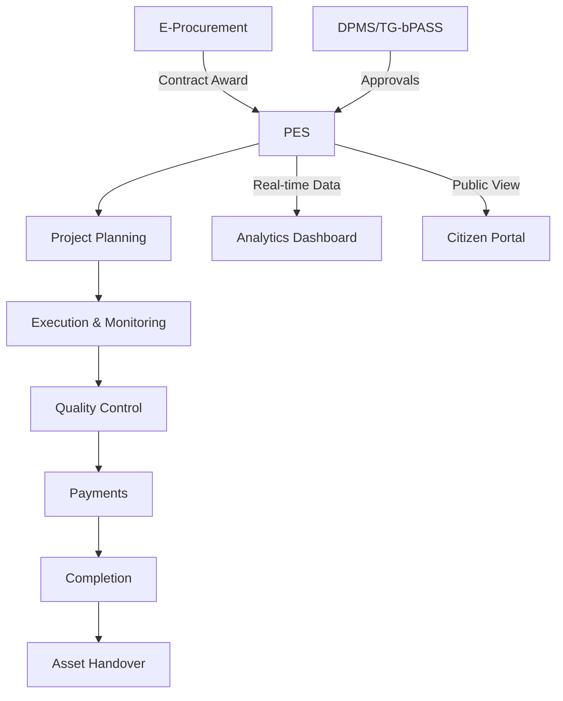

# HMDA Chief Engineer's Office - Project Execution System Proposal

## Executive Summary

The Hyderabad Metropolitan Development Authority (HMDA) manages infrastructure projects worth over Rs 15,000 crores annually across the metropolitan region. While HMDA has successfully digitized project approvals through DPMS and procurement through e-tendering, the critical execution phase—where 70% of project time and 100% of budget is spent—remains largely manual and disconnected.

This proposal outlines the implementation of a comprehensive **Project Execution System (PES)** that will complete HMDA's digital transformation journey, creating an end-to-end digital corridor from project conception to citizen benefit.

## 1. Project Vision

### 1.1 Vision Statement
"To establish HMDA as India's first metropolitan authority with a fully integrated digital project lifecycle management system, setting benchmarks for transparency, efficiency, and citizen-centric governance."

### 1.2 Mission
Transform project execution through a unified digital platform that:
- Provides real-time visibility of all projects
- Automates workflow and approvals
- Ensures quality through digital gates
- Enables data-driven decision making
- Enhances transparency for citizens

## 2. Current State Analysis

### 2.1 Existing Digital Ecosystem

HMDA has made significant progress in digitalization:
- **DPMS**: Handles 50,000+ building permissions annually
- **TG-bPASS**: 21-day approval guarantee system
- **E-Procurement**: All tenders above Rs 10 lakhs
- **GIS Platform**: Spatial data management

### 2.2 Critical Gaps Identified

Despite these advances, the execution phase faces challenges:

| Area | Current State | Impact |
|------|--------------|---------|
| Progress Tracking | Excel sheets, manual reports | 2-3 week delays in decision making |
| Quality Control | Paper-based inspections | 30% rework due to quality issues |
| Payment Processing | Manual measurement books | 45-day average payment cycle |
| Resource Management | No unified tracking | 25% resource underutilization |
| Public Transparency | Limited project visibility | Low citizen satisfaction scores |

### 2.3 Opportunity Analysis

The Project Execution System addresses a Rs 10,000+ crore annual execution portfolio with potential for:
- **20% cost savings** through better monitoring (Rs 200 crores/year)
- **25% time reduction** in project completion
- **40% productivity improvement** for field engineers
- **90% reduction** in paperwork

## 3. Proposed Solution

### 3.1 System Overview

The Project Execution System (PES) is an integrated platform that manages the complete project lifecycle from tender award to asset handover.

### 3.2 Core Modules

#### 3.2.1 Project Management
- Work breakdown structure
- Milestone tracking
- Resource allocation
- Document management
- Communication hub

#### 3.2.2 Quality Assurance
- Digital inspection checklists
- Photo/video evidence
- Test result management
- Non-conformance tracking
- Third-party audit integration

#### 3.2.3 Financial Management
- Digital measurement books
- Multi-level approvals
- Payment tracking
- Budget vs actual analysis
- Fund utilization reports

#### 3.2.4 Analytics & Reporting
- Real-time dashboards
- Predictive analytics
- Performance scorecards
- Exception reporting
- Public transparency portal

### 3.3 Key Features

1. **Mobile-First Design**
   - Android/iOS apps for field updates
   - Offline capability
   - GPS-tagged photos
   - Voice-to-text notes

2. **AI/ML Integration**
   - Delay prediction
   - Cost overrun alerts
   - Resource optimization
   - Quality pattern analysis

3. **Blockchain-Ready**
   - Immutable project records
   - Smart contracts for milestones
   - Transparent audit trail

4. **IoT Integration**
   - Sensor data for monitoring
   - Equipment tracking
   - Environmental monitoring

## 4. Stakeholder Benefits

### 4.1 For HMDA Leadership

- **Strategic View**: Real-time portfolio dashboard
- **Risk Management**: Early warning system for delays/overruns
- **Decision Support**: AI-powered insights and recommendations
- **Compliance**: Automated regulatory reporting

### 4.2 For Engineers

- **Productivity**: 40% reduction in paperwork
- **Mobility**: Update from field via mobile
- **Collaboration**: Integrated communication
- **Career Growth**: Digital skill enhancement

### 4.3 For Contractors

- **Faster Payments**: 21-day payment cycle
- **Clear Communication**: Direct channel with HMDA
- **Performance Tracking**: Transparent evaluation
- **Reduced Disputes**: Digital documentation

### 4.4 For Citizens

- **Transparency**: Track neighborhood projects
- **Accountability**: See fund utilization
- **Participation**: Report issues/feedback
- **Information**: Project timelines and impacts

## 5. Strategic Alignment

### 5.1 Smart City Objectives

The PES directly supports Hyderabad's Smart City vision:
- **Digital Infrastructure**: Foundation for smart governance
- **Data-Driven Decisions**: Analytics for better planning
- **Citizen Engagement**: Transparent governance
- **Sustainable Development**: Optimized resource use

### 5.2 Government Initiatives

Aligns with key government programs:
- **Digital India**: Paperless processes
- **Ease of Doing Business**: Simplified procedures
- **Good Governance**: Transparency and accountability
- **Make in India**: Local technology development

### 5.3 HMDA Strategic Goals

Supports HMDA's 2025 objectives:
- 100% digital operations
- 50% reduction in project delays
- Top 3 in transparency index
- Citizen satisfaction >4.5/5

## 6. Implementation Approach

### 6.1 Phased Rollout

**Phase 1: Foundation (Months 1-6)**
- Core modules development
- Integration with existing systems
- Pilot with 5 diverse projects
- User training program

**Phase 2: Scale (Months 7-12)**
- Rollout to projects >Rs 10 crores
- Mobile app deployment
- Public portal launch
- Advanced analytics

**Phase 3: Innovation (Months 13-18)**
- AI/ML deployment
- IoT integration
- Blockchain proof-of-concept
- Complete ecosystem integration

### 6.2 Change Management

Comprehensive strategy ensuring smooth adoption:
- Executive sponsorship
- Phased user onboarding
- Incentive programs
- Continuous support
- Success celebrations

## 7. Technology Overview

### 7.1 Architecture Principles

- **Cloud-Native**: Scalable and resilient
- **API-First**: Seamless integrations
- **Microservices**: Modular and flexible
- **Security-by-Design**: Data protection
- **Mobile-Responsive**: Any device access

### 7.2 Technology Stack

- **Frontend**: React/Angular
- **Backend**: Node.js/Java
- **Database**: PostgreSQL
- **Mobile**: React Native
- **Analytics**: Apache Spark
- **AI/ML**: TensorFlow

## 8. Investment and Returns

### 8.1 Project Investment

**Development & Implementation**: Rs 12-15 crores
- Software development: Rs 8-10 crores
- Infrastructure: Rs 2-3 crores
- Training & change management: Rs 2 crores

**Annual Operations**: Rs 3-4 crores
- Maintenance & support
- Cloud infrastructure
- Continuous enhancements

### 8.2 Return on Investment

**Quantifiable Benefits** (Annual):
- Cost savings: Rs 200+ crores (20% of overruns)
- Time value: Rs 150+ crores (faster completion)
- Productivity: Rs 50+ crores (efficiency gains)
- **Total**: Rs 400+ crores annually

**ROI**: 2,500%+ over 5 years

### 8.3 Intangible Benefits

- Enhanced HMDA reputation
- Improved citizen trust
- Better vendor relationships
- Employee satisfaction
- Environmental benefits

## 9. Risk Assessment and Mitigation

| Risk | Probability | Impact | Mitigation Strategy |
|------|------------|--------|-------------------|
| User Resistance | Medium | High | Phased rollout, training, incentives |
| Integration Complexity | Medium | Medium | API-first design, proven integrations |
| Data Migration | Low | High | Automated tools, validation checks |
| Technology Obsolescence | Low | Medium | Modern stack, regular updates |
| Budget Overrun | Low | Medium | Fixed-price contracts, clear scope |

## 10. Success Metrics

### 10.1 Key Performance Indicators

**Year 1 Targets**:
- System adoption: >90%
- Project delays: -25%
- Cost overruns: -20%
- Payment cycle: <30 days
- User satisfaction: >4.0/5

**Year 3 Targets**:
- 100% digital execution
- Project delays: -50%
- Cost overruns: -40%
- Payment cycle: <21 days
- User satisfaction: >4.5/5

### 10.2 Monitoring Framework

- Monthly executive dashboards
- Quarterly stakeholder reviews
- Annual third-party audits
- Continuous user feedback
- Public transparency reports

## 11. Competitive Advantage

### 11.1 First-Mover Benefits

HMDA will be:
- **First in India**: Integrated project lifecycle system
- **Benchmark Setter**: Model for other cities
- **Innovation Leader**: AI/ML in infrastructure
- **Transparency Pioneer**: Real-time public dashboards

### 11.2 Replication Potential

The system can be:
- Licensed to other metros
- Customized for state PWDs
- Adapted for smart cities
- Exported internationally

## 12. Call to Action

### 12.1 Immediate Next Steps

1. **Leadership Approval**: Present to HMDA Board
2. **Detailed Planning**: 2-week discovery workshop
3. **Proof of Concept**: 4-week POC development
4. **Partner Selection**: RFP process initiation
5. **Project Launch**: Form implementation team

### 12.2 Timeline

- **Month 1**: Approval and planning
- **Month 2-3**: Partner selection
- **Month 4-6**: Phase 1 development
- **Month 7-12**: Phase 2 rollout
- **Month 13-18**: Phase 3 innovation

## 13. Conclusion

The Project Execution System represents a transformative opportunity for HMDA to complete its digital journey and establish itself as a global leader in urban governance. With proven ROI, strategic alignment, and comprehensive benefits for all stakeholders, this initiative will:

- Save hundreds of crores through better project management
- Deliver infrastructure faster to citizens
- Enhance transparency and accountability
- Position HMDA as an innovation leader
- Create a replicable model for India

The time to act is now. Every month of delay costs HMDA and citizens in terms of project overruns, quality issues, and lost opportunities. By approving this initiative, HMDA leadership will leave a lasting legacy of digital transformation that benefits millions of citizens for decades to come.

---

**Contact for Queries**:
[Project Implementation Team]
Email: pes@hmda.gov.in
Phone: +91-40-23419500

*"Building Tomorrow's Hyderabad, Digitally Today"*