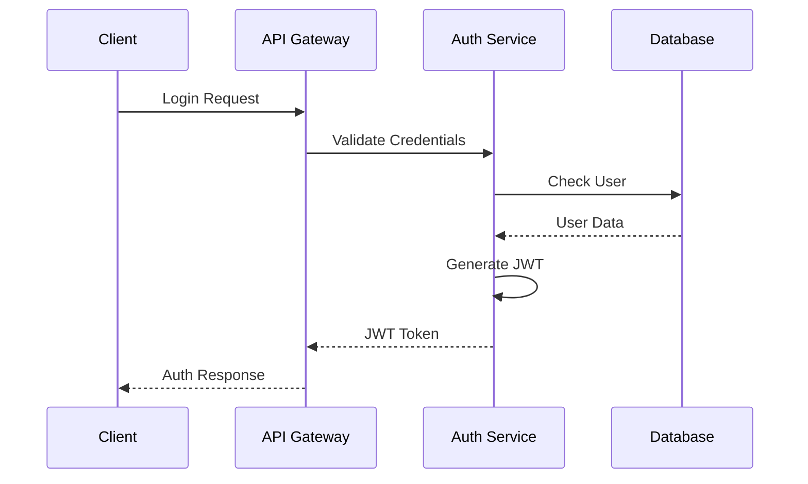
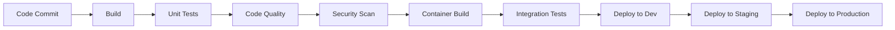

# Project Execution System - Technical Architecture Document

## Executive Summary

This document presents the technical architecture for the HMDA Project Execution System (PES), designed as a cloud-native, microservices-based platform that ensures scalability, security, and seamless integration with existing HMDA systems.

## 1. Architecture Overview

### 1.1 High-Level Architecture

```
┌─────────────────────────────────────────────────────────────────────┐
│                           Presentation Layer                         │
├─────────────────┬─────────────────┬─────────────────┬──────────────┤
│   Web Portal    │  Mobile Apps    │  Public Portal  │  Admin Portal│
│  (React/Angular)│  (React Native) │   (Next.js)     │  (React)     │
└─────────────────┴─────────────────┴─────────────────┴──────────────┘
                                    │
                    ┌───────────────┴───────────────┐
                    │      API Gateway Layer         │
                    │  (Kong/AWS API Gateway)       │
                    └───────────────┬───────────────┘
                                    │
┌─────────────────────────────────────────────────────────────────────┐
│                        Microservices Layer                          │
├──────────┬──────────┬──────────┬──────────┬──────────┬────────────┤
│  Auth    │ Project  │ Quality  │Financial │Analytics │Integration │
│ Service  │ Service  │ Service  │ Service  │ Service  │  Service   │
└──────────┴──────────┴──────────┴──────────┴──────────┴────────────┘
                                    │
                    ┌───────────────┴───────────────┐
                    │      Data Access Layer        │
                    │    (Repository Pattern)       │
                    └───────────────┬───────────────┘
                                    │
┌─────────────────────────────────────────────────────────────────────┐
│                          Data Layer                                 │
├─────────────┬─────────────┬─────────────┬─────────────┬───────────┤
│ PostgreSQL  │   MongoDB   │   Redis     │ Elasticsearch│   S3      │
│ (Primary)   │ (Documents) │  (Cache)    │  (Search)    │ (Files)   │
└─────────────┴─────────────┴─────────────┴─────────────┴───────────┘
```

### 1.2 Architecture Principles

1. **Microservices Architecture**: Loosely coupled, independently deployable services
2. **API-First Design**: All functionality exposed through well-documented APIs
3. **Cloud-Native**: Designed for containerization and orchestration
4. **Security by Design**: Security considerations at every layer
5. **Scalability**: Horizontal scaling capabilities built-in
6. **Resilience**: Fault tolerance and self-healing mechanisms

## 2. Technology Stack

### 2.1 Frontend Technologies

| Component | Technology | Justification |
|-----------|------------|---------------|
| Web Portal | React 18 with TypeScript | Component reusability, type safety, large ecosystem |
| Mobile Apps | React Native | Cross-platform development, code sharing with web |
| State Management | Redux Toolkit | Predictable state management, debugging tools |
| UI Framework | Material-UI / Ant Design | Consistent design, accessibility |
| Build Tools | Webpack 5 / Vite | Fast builds, modern tooling |

### 2.2 Backend Technologies

| Component | Technology | Justification |
|-----------|------------|---------------|
| Runtime | Node.js 18 LTS | JavaScript ecosystem, async capabilities |
| Framework | NestJS | Enterprise-grade, TypeScript, modular |
| API Gateway | Kong | Open-source, plugins, rate limiting |
| Message Queue | RabbitMQ | Reliability, routing capabilities |
| Caching | Redis | Performance, pub/sub capabilities |

### 2.3 Data Technologies

| Component | Technology | Justification |
|-----------|------------|---------------|
| Primary Database | PostgreSQL 15 | ACID compliance, JSON support, extensions |
| Document Store | MongoDB | Flexible schema, document storage |
| Search Engine | Elasticsearch | Full-text search, analytics |
| Object Storage | MinIO / AWS S3 | Scalable file storage |
| Data Warehouse | Apache Druid | Real-time analytics |

### 2.4 Infrastructure Technologies

| Component | Technology | Justification |
|-----------|------------|---------------|
| Containerization | Docker | Standard containerization |
| Orchestration | Kubernetes | Industry standard, auto-scaling |
| Service Mesh | Istio | Traffic management, security |
| CI/CD | GitLab CI / Jenkins | Automation, integration |
| Monitoring | Prometheus + Grafana | Metrics and visualization |

## 3. Microservices Architecture

### 3.1 Service Decomposition

#### 3.1.1 Authentication Service
```yaml
Service: auth-service
Responsibilities:
  - User authentication
  - Token management
  - Role-based access control
  - Session management
  - SSO integration
Database: PostgreSQL (users, roles, permissions)
APIs:
  - POST /auth/login
  - POST /auth/logout
  - POST /auth/refresh
  - GET /auth/verify
```

#### 3.1.2 Project Management Service
```yaml
Service: project-service
Responsibilities:
  - Project CRUD operations
  - Milestone management
  - Resource allocation
  - Progress tracking
  - Document management
Database: PostgreSQL (projects, milestones, resources)
APIs:
  - GET/POST/PUT/DELETE /projects
  - GET/POST /projects/{id}/milestones
  - PUT /projects/{id}/progress
  - GET /projects/{id}/documents
```

#### 3.1.3 Quality Control Service
```yaml
Service: quality-service
Responsibilities:
  - Inspection management
  - Test result tracking
  - Non-conformance management
  - Quality metrics
Database: PostgreSQL + MongoDB (inspections, test results)
APIs:
  - POST /inspections
  - GET /inspections/{id}
  - POST /tests/results
  - GET /quality/metrics
```

#### 3.1.4 Financial Service
```yaml
Service: financial-service
Responsibilities:
  - Measurement book management
  - Bill processing
  - Payment tracking
  - Budget monitoring
Database: PostgreSQL (measurements, bills, payments)
APIs:
  - POST /measurements
  - POST /bills
  - GET /payments/status
  - GET /budgets/utilization
```

#### 3.1.5 Analytics Service
```yaml
Service: analytics-service
Responsibilities:
  - Data aggregation
  - Report generation
  - Predictive analytics
  - Dashboard data
Database: Apache Druid + Elasticsearch
APIs:
  - GET /analytics/dashboard
  - POST /reports/generate
  - GET /predictions/delays
  - GET /analytics/trends
```

#### 3.1.6 Integration Service
```yaml
Service: integration-service
Responsibilities:
  - External system integration
  - Data synchronization
  - API transformation
  - Event handling
Database: MongoDB (integration logs, mappings)
APIs:
  - POST /integrate/dpms
  - POST /integrate/eprocurement
  - GET /sync/status
  - POST /webhooks/{system}
```

### 3.2 Service Communication

#### 3.2.1 Synchronous Communication
- RESTful APIs for client-service communication
- gRPC for inter-service communication
- Circuit breaker pattern for resilience
- Service discovery using Consul/Eureka

#### 3.2.2 Asynchronous Communication
- Event-driven architecture using RabbitMQ
- Event sourcing for audit trails
- CQRS pattern for read/write separation
- Saga pattern for distributed transactions

## 4. Data Architecture

### 4.1 Database Design

#### 4.1.1 Primary Database Schema (PostgreSQL)

```sql
-- Core Tables
CREATE TABLE organizations (
    id UUID PRIMARY KEY,
    name VARCHAR(255),
    type VARCHAR(50),
    parent_id UUID,
    metadata JSONB
);

CREATE TABLE users (
    id UUID PRIMARY KEY,
    username VARCHAR(100) UNIQUE,
    email VARCHAR(255) UNIQUE,
    role_id UUID,
    organization_id UUID,
    created_at TIMESTAMP
);

CREATE TABLE projects (
    id UUID PRIMARY KEY,
    code VARCHAR(50) UNIQUE,
    name VARCHAR(500),
    category VARCHAR(100),
    budget DECIMAL(15,2),
    start_date DATE,
    end_date DATE,
    status VARCHAR(50),
    metadata JSONB
);

-- Partitioned Tables for Performance
CREATE TABLE measurements (
    id UUID,
    project_id UUID,
    date DATE,
    data JSONB,
    created_at TIMESTAMP
) PARTITION BY RANGE (date);

CREATE TABLE project_documents (
    id UUID,
    project_id UUID,
    document_type VARCHAR(100),
    file_path TEXT,
    uploaded_at TIMESTAMP
) PARTITION BY LIST (document_type);
```

#### 4.1.2 Document Store Schema (MongoDB)

```javascript
// Inspection Collection
{
  _id: ObjectId,
  projectId: UUID,
  inspectionDate: Date,
  inspector: {
    id: UUID,
    name: String
  },
  checklist: [{
    item: String,
    status: String,
    remarks: String,
    photos: [String]
  }],
  location: {
    type: "Point",
    coordinates: [longitude, latitude]
  },
  createdAt: Date
}

// Workflow Collection
{
  _id: ObjectId,
  workflowType: String,
  projectId: UUID,
  currentStage: String,
  stages: [{
    name: String,
    approver: UUID,
    status: String,
    timestamp: Date,
    comments: String
  }],
  metadata: Object
}
```

### 4.2 Data Management Strategies

#### 4.2.1 Data Partitioning
- Time-based partitioning for transactional data
- List partitioning for categorical data
- Hash partitioning for user data
- Automatic partition management

#### 4.2.2 Data Archival
- Archive data older than 2 years
- Compressed storage for archives
- Searchable archive with metadata
- Automated archival process

#### 4.2.3 Data Replication
- Master-slave replication for PostgreSQL
- MongoDB replica sets
- Cross-region replication for DR
- Read replicas for analytics

## 5. Security Architecture

### 5.1 Security Layers

```
┌─────────────────────────────────────────────────────────────┐
│                    WAF (Web Application Firewall)           │
├─────────────────────────────────────────────────────────────┤
│                    DDoS Protection                          │
├─────────────────────────────────────────────────────────────┤
│                    API Gateway (Rate Limiting)              │
├─────────────────────────────────────────────────────────────┤
│                    Service Mesh (mTLS)                      │
├─────────────────────────────────────────────────────────────┤
│                    Application Security                     │
├─────────────────────────────────────────────────────────────┤
│                    Database Encryption                      │
└─────────────────────────────────────────────────────────────┘
```

### 5.2 Authentication & Authorization

#### 5.2.1 Authentication Flow


#### 5.2.2 Authorization Model
- Role-Based Access Control (RBAC)
- Attribute-Based Access Control (ABAC)
- Policy Decision Point (PDP)
- Policy Enforcement Point (PEP)

### 5.3 Security Implementations

#### 5.3.1 API Security
- OAuth 2.0 / JWT tokens
- API key management
- Rate limiting per client
- Request validation
- CORS configuration

#### 5.3.2 Data Security
- Encryption at rest (AES-256)
- Encryption in transit (TLS 1.3)
- Field-level encryption for PII
- Database connection encryption
- Key rotation policies

#### 5.3.3 Application Security
- Input validation
- SQL injection prevention
- XSS protection
- CSRF tokens
- Security headers

## 6. Integration Architecture

### 6.1 Integration Patterns

#### 6.1.1 External System Integration

```
External System → Webhook → Integration Service → Message Queue → Internal Services
                     ↓
                  Adapter → Transform → Validate → Route
```

#### 6.1.2 Integration Adapters

| System | Integration Method | Data Format | Sync Type |
|--------|-------------------|-------------|-----------|
| DPMS | REST API | JSON | Real-time |
| E-Procurement | SOAP/REST | XML/JSON | Batch |
| TG-bPASS | REST API | JSON | Real-time |
| Payment Gateway | REST API | JSON | Real-time |
| SMS Gateway | REST API | JSON | Async |

### 6.2 API Design

#### 6.2.1 API Standards
- RESTful design principles
- OpenAPI 3.0 specification
- Versioning strategy (/v1, /v2)
- Consistent error responses
- HATEOAS where applicable

#### 6.2.2 API Response Format
```json
{
  "success": true,
  "data": {
    // Response data
  },
  "metadata": {
    "timestamp": "2025-01-20T10:00:00Z",
    "version": "1.0",
    "totalCount": 100,
    "page": 1,
    "pageSize": 20
  },
  "error": null
}
```

## 7. Deployment Architecture

### 7.1 Container Architecture

```yaml
# Kubernetes Deployment Example
apiVersion: apps/v1
kind: Deployment
metadata:
  name: project-service
spec:
  replicas: 3
  selector:
    matchLabels:
      app: project-service
  template:
    metadata:
      labels:
        app: project-service
    spec:
      containers:
      - name: project-service
        image: hmda/project-service:1.0.0
        ports:
        - containerPort: 3000
        env:
        - name: DB_HOST
          valueFrom:
            secretKeyRef:
              name: db-secret
              key: host
        resources:
          requests:
            memory: "256Mi"
            cpu: "250m"
          limits:
            memory: "512Mi"
            cpu: "500m"
```

### 7.2 Infrastructure Requirements

#### 7.2.1 Development Environment
- 3 nodes (4 vCPU, 16GB RAM each)
- 500GB SSD storage
- Basic load balancer
- Single region deployment

#### 7.2.2 Production Environment
- 10 nodes (8 vCPU, 32GB RAM each)
- 5TB SSD storage (expandable)
- Application load balancer
- Multi-AZ deployment
- Auto-scaling groups

#### 7.2.3 Disaster Recovery
- Secondary region setup
- Real-time data replication
- Automated failover
- RTO: 30 minutes
- RPO: 5 minutes

## 8. Performance Architecture

### 8.1 Caching Strategy

#### 8.1.1 Cache Layers
```
┌─────────────────┐
│ CDN Cache       │ ← Static assets, public data
├─────────────────┤
│ API Gateway     │ ← API response cache
├─────────────────┤
│ Redis Cache     │ ← Session, frequently accessed data
├─────────────────┤
│ Application     │ ← In-memory cache
├─────────────────┤
│ Database        │ ← Query result cache
└─────────────────┘
```

#### 8.1.2 Cache Policies
- Static assets: 30 days
- API responses: 5-60 seconds
- User sessions: 30 minutes
- Reference data: 24 hours
- Real-time data: No cache

### 8.2 Performance Optimization

#### 8.2.1 Database Optimization
- Connection pooling
- Query optimization
- Index strategies
- Materialized views
- Read replicas

#### 8.2.2 Application Optimization
- Lazy loading
- Code splitting
- Image optimization
- Compression (gzip/brotli)
- CDN utilization

## 9. Monitoring and Observability

### 9.1 Monitoring Stack

```
┌─────────────────────────────────────────────────────────────┐
│                    Grafana Dashboard                        │
├──────────────┬──────────────┬──────────────┬──────────────┤
│ Prometheus   │ Elasticsearch │    Jaeger    │   Loki       │
│  (Metrics)   │   (Logs)      │  (Traces)    │ (App Logs)   │
└──────────────┴──────────────┴──────────────┴──────────────┘
```

### 9.2 Key Metrics

#### 9.2.1 Application Metrics
- Request rate
- Response time
- Error rate
- Throughput
- Saturation

#### 9.2.2 Business Metrics
- Active users
- Project creation rate
- Payment processing time
- Document upload rate
- Report generation time

### 9.3 Alerting Strategy

| Metric | Warning Threshold | Critical Threshold | Action |
|--------|------------------|-------------------|---------|
| CPU Usage | 70% | 85% | Auto-scale |
| Memory Usage | 75% | 90% | Investigate |
| API Response Time | 2s | 5s | Performance check |
| Error Rate | 1% | 5% | Immediate investigation |
| Disk Usage | 80% | 90% | Cleanup/Expand |

## 10. DevOps and CI/CD

### 10.1 CI/CD Pipeline



### 10.2 Deployment Strategy

#### 10.2.1 Blue-Green Deployment
- Zero-downtime deployments
- Easy rollback capability
- A/B testing support
- Gradual traffic shifting

#### 10.2.2 GitOps Workflow
- Infrastructure as Code (Terraform)
- Configuration in Git
- Automated synchronization
- Audit trail of changes

## 11. Disaster Recovery

### 11.1 Backup Strategy

| Data Type | Backup Frequency | Retention | Storage |
|-----------|-----------------|-----------|----------|
| Database | Every 6 hours | 30 days | S3 |
| Files | Daily | 90 days | S3 IA |
| Logs | Real-time | 30 days | S3 |
| Configuration | On change | Forever | Git |

### 11.2 Recovery Procedures

#### 11.2.1 RTO/RPO Targets
- RTO (Recovery Time Objective): 30 minutes
- RPO (Recovery Point Objective): 5 minutes
- Automated failover for critical services
- Manual intervention for non-critical

#### 11.2.2 DR Testing
- Monthly DR drills
- Automated backup verification
- Recovery time measurement
- Documentation updates

## 12. Scalability Considerations

### 12.1 Horizontal Scaling

```yaml
# Horizontal Pod Autoscaler
apiVersion: autoscaling/v2
kind: HorizontalPodAutoscaler
metadata:
  name: project-service-hpa
spec:
  scaleTargetRef:
    apiVersion: apps/v1
    kind: Deployment
    name: project-service
  minReplicas: 3
  maxReplicas: 20
  metrics:
  - type: Resource
    resource:
      name: cpu
      target:
        type: Utilization
        averageUtilization: 70
  - type: Resource
    resource:
      name: memory
      target:
        type: Utilization
        averageUtilization: 80
```

### 12.2 Database Scaling
- Vertical scaling for write-heavy operations
- Read replicas for read scaling
- Sharding for extreme scale
- Connection pooling optimization

## 13. Future Considerations

### 13.1 Technology Roadmap
- GraphQL API adoption
- Event streaming with Kafka
- Serverless functions
- Machine learning pipeline
- Blockchain integration

### 13.2 Architecture Evolution
- Micro-frontends
- Service mesh maturity
- Multi-cloud strategy
- Edge computing
- Real-time analytics

---

**Document Version**: 1.0  
**Last Updated**: January 2025  
**Approved By**: [Technical Architecture Board]

*This technical architecture provides a robust, scalable, and secure foundation for the HMDA Project Execution System, ensuring it can meet current needs while adapting to future requirements.*