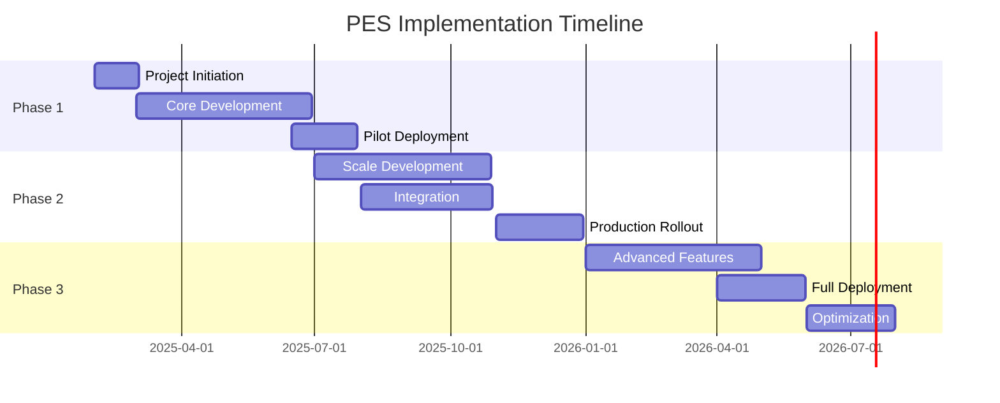

# Project Execution System - Implementation Roadmap

## Executive Summary

This implementation roadmap provides a detailed 18-month plan for deploying the HMDA Project Execution System (PES). The approach emphasizes phased delivery, risk mitigation, and early value realization through strategic pilot implementations.

## 1. Implementation Overview

### 1.1 Implementation Principles

1. **Agile Delivery**: 2-week sprints with continuous delivery
2. **Phase-Gate Approach**: Clear milestones and decision points
3. **Risk-Based Rollout**: Start with low-risk pilots
4. **User-Centric Design**: Continuous feedback incorporation
5. **Value-First**: Early wins to build momentum

### 1.2 Implementation Timeline



## 2. Phase 1: Foundation (Months 1-6)

### 2.1 Month 1: Project Initiation

#### Week 1-2: Setup and Planning
- [ ] Form core project team
- [ ] Establish project governance structure
- [ ] Setup project management tools
- [ ] Conduct kickoff meeting
- [ ] Finalize project charter

#### Week 3-4: Detailed Planning
- [ ] Complete detailed requirements analysis
- [ ] Finalize technical architecture
- [ ] Create detailed project plan
- [ ] Identify pilot projects
- [ ] Setup development environment

**Deliverables**:
- Project charter approved
- Detailed project plan
- Development environment ready
- Team onboarded

### 2.2 Months 2-5: Core Development

#### Month 2: Foundation Modules
**Sprint 1-2**: Authentication & User Management
- User registration and login
- Role-based access control
- Organization hierarchy
- SSO integration planning

**Sprint 3-4**: Project Management Core
- Project creation workflow
- Basic milestone tracking
- Document upload functionality
- Team assignment features

#### Month 3: Essential Features
**Sprint 5-6**: Progress Tracking
- Progress update interfaces
- Milestone management
- Basic reporting
- Mobile app prototype

**Sprint 7-8**: Quality Module
- Inspection checklist creation
- Basic inspection workflow
- Photo upload capability
- Non-conformance tracking

#### Month 4: Financial Features
**Sprint 9-10**: Measurement Book
- Digital MB creation
- Multi-level approval workflow
- Quantity tracking
- Basic calculations

**Sprint 11-12**: Integration Foundation
- API gateway setup
- DPMS integration design
- E-procurement integration planning
- Data migration tools

#### Month 5: Testing and Refinement
**Sprint 13-14**: System Integration
- End-to-end testing
- Performance optimization
- Security testing
- Bug fixes and improvements

**Sprint 15-16**: Pilot Preparation
- Pilot project setup
- User training materials
- Deployment procedures
- Support processes

### 2.3 Month 6: Pilot Deployment

#### Pilot Project Selection
| Project Type | Project Name | Value | Duration | Complexity |
|-------------|--------------|-------|----------|------------|
| Road | Colony Road Development | Rs 5 Cr | 6 months | Low |
| Building | Community Center | Rs 3 Cr | 4 months | Medium |
| Water Supply | Pipeline Extension | Rs 8 Cr | 8 months | Medium |
| Park | Neighborhood Park | Rs 2 Cr | 3 months | Low |
| Drainage | Storm Water Drain | Rs 4 Cr | 5 months | Low |

#### Pilot Activities
- Week 1: Pilot user training
- Week 2: System deployment
- Week 3-6: Active monitoring and support
- Week 7-8: Feedback collection and analysis

**Success Criteria**:
- 90% user adoption
- Zero critical bugs
- <5 second page load time
- Positive user feedback

## 3. Phase 2: Scale and Integration (Months 7-12)

### 3.1 Months 7-9: Enhanced Development

#### Month 7: Advanced Features
**Sprint 17-18**: Analytics Foundation
- Dashboard framework
- Basic analytics
- Report builder
- Data visualization

**Sprint 19-20**: Payment Integration
- Payment workflow
- Treasury integration
- Invoice management
- Payment tracking

#### Month 8: System Integration
**Sprint 21-22**: DPMS Integration
- API development
- Data synchronization
- Status updates
- Document sharing

**Sprint 23-24**: E-Procurement Integration
- Contract data import
- Vendor synchronization
- Performance feedback
- Automated workflows

#### Month 9: Mobile and Public Portal
**Sprint 25-26**: Mobile Apps
- iOS app development
- Android app development
- Offline capabilities
- Push notifications

**Sprint 27-28**: Public Portal
- Project map view
- Progress tracking
- Fund utilization display
- Feedback mechanism

### 3.2 Months 10-11: Production Preparation

#### Month 10: Performance and Security
- Load testing (1000+ concurrent users)
- Security audit and fixes
- Performance optimization
- Disaster recovery setup

#### Month 11: Rollout Preparation
- Production environment setup
- Data migration from Excel/legacy systems
- Comprehensive user training
- Change management activities

### 3.3 Month 12: Production Rollout

#### Rollout Strategy
**Week 1-2**: Soft Launch
- 10 projects (Rs 10-50 Cr range)
- Close monitoring
- Daily review meetings
- Quick issue resolution

**Week 3-4**: Expanded Rollout
- 50 projects
- All project categories
- Full feature utilization
- Performance monitoring

**Week 5-8**: Full Rollout
- All projects >Rs 10 Cr
- Mandatory usage
- Legacy system sunset
- Continuous support

## 4. Phase 3: Innovation and Optimization (Months 13-18)

### 4.1 Months 13-15: Advanced Features

#### Month 13: AI/ML Implementation
- Delay prediction model
- Cost overrun analysis
- Resource optimization
- Anomaly detection

#### Month 14: IoT Integration
- Sensor integration framework
- Real-time monitoring
- Environmental tracking
- Equipment monitoring

#### Month 15: Blockchain Proof of Concept
- Smart contracts for milestones
- Immutable project records
- Transparent audit trail
- Payment automation

### 4.2 Months 16-17: Full Deployment

#### Deployment Scope
- All HMDA projects regardless of value
- Complete feature utilization
- Advanced analytics active
- Public portal fully functional

#### Success Metrics
- 100% project coverage
- 25% reduction in delays
- 20% cost savings
- 4.5/5 user satisfaction

### 4.3 Month 18: Optimization and Handover

#### Optimization Activities
- Performance fine-tuning
- Process optimization
- User feedback incorporation
- Documentation finalization

#### Handover Process
- Complete documentation transfer
- Knowledge transfer sessions
- Support transition
- Future roadmap planning

## 5. Resource Requirements

### 5.1 Team Structure

```
Project Sponsor (Commissioner/CE)
        |
Project Steering Committee
        |
Program Manager
        |
    |-------|--------|---------|---------|
Technical   Functional  Quality   Change    PMO
Lead        Lead        Lead    Management
    |          |          |         |        |
Dev Team   BA Team    QA Team  Training   Admin
(8-10)     (4-5)      (3-4)    Team(2-3)  (2-3)
```

### 5.2 Resource Plan

| Phase | Development | Testing | Training | Support | Total FTE |
|-------|------------|---------|----------|---------|-----------|
| Phase 1 | 10 | 4 | 2 | 2 | 18 |
| Phase 2 | 12 | 6 | 4 | 4 | 26 |
| Phase 3 | 8 | 4 | 6 | 6 | 24 |

### 5.3 Skill Requirements

**Technical Skills**:
- Full-stack developers (React, Node.js)
- Mobile developers (React Native)
- DevOps engineers (Kubernetes, CI/CD)
- Data engineers (PostgreSQL, MongoDB)
- AI/ML engineers (Python, TensorFlow)

**Functional Skills**:
- Domain experts (Civil engineering)
- Business analysts
- Project managers
- Change management specialists
- Training specialists

## 6. Risk Management

### 6.1 Implementation Risks

| Risk | Probability | Impact | Mitigation |
|------|------------|--------|------------|
| User resistance | High | High | Phased rollout, incentives, training |
| Integration delays | Medium | High | Early API development, vendor coordination |
| Resource availability | Medium | Medium | Partner augmentation, cross-training |
| Scope creep | High | Medium | Strong governance, change control |
| Technology challenges | Low | High | POCs, expert consultation |

### 6.2 Risk Mitigation Strategies

#### Change Resistance Mitigation
1. **Executive Championship**: Regular communication from leadership
2. **Early Adopter Program**: Incentives for early users
3. **Success Stories**: Showcase pilot successes
4. **Continuous Support**: 24x7 helpdesk during rollout

#### Technical Risk Mitigation
1. **Proof of Concepts**: For complex integrations
2. **Fallback Options**: Manual processes during transition
3. **Incremental Migration**: Gradual data movement
4. **Parallel Run**: Legacy and new system together

## 7. Change Management Plan

### 7.1 Stakeholder Engagement

| Stakeholder | Engagement Strategy | Frequency |
|------------|-------------------|-----------|
| Leadership | Steering committee meetings | Monthly |
| Department heads | Progress updates | Bi-weekly |
| End users | Training and feedback | Continuous |
| Contractors | Orientation sessions | Quarterly |
| Citizens | Public communications | Monthly |

### 7.2 Communication Plan

#### Communication Channels
- Email newsletters
- WhatsApp broadcasts
- Portal announcements
- Town halls
- Training sessions

#### Key Messages
- Month 1-3: "Preparing for digital transformation"
- Month 4-6: "Pilot success stories"
- Month 7-9: "Get ready for rollout"
- Month 10-12: "Going live"
- Month 13-18: "Continuous improvement"

### 7.3 Training Plan

| User Group | Training Type | Duration | Mode |
|-----------|--------------|----------|------|
| Executives | Overview | 2 hours | Classroom |
| Engineers | Comprehensive | 2 days | Hands-on |
| Contractors | Basic usage | 4 hours | Online |
| Support staff | System admin | 3 days | Hands-on |

## 8. Quality Assurance

### 8.1 Testing Strategy

#### Testing Phases
1. **Unit Testing**: Developer-led, 80% coverage
2. **Integration Testing**: API and system integration
3. **System Testing**: End-to-end scenarios
4. **UAT**: User acceptance with real scenarios
5. **Performance Testing**: Load and stress testing
6. **Security Testing**: Vulnerability assessment

### 8.2 Acceptance Criteria

**Functional Acceptance**:
- All user stories completed
- Zero critical bugs
- <10 minor bugs
- UAT sign-off received

**Non-functional Acceptance**:
- Page load <3 seconds
- 99.9% uptime
- Support 1000 concurrent users
- Pass security audit

## 9. Budget and Timeline

### 9.1 Phase-wise Budget

| Phase | Development | Infrastructure | Training | Contingency | Total |
|-------|------------|---------------|----------|-------------|--------|
| Phase 1 | Rs 3 Cr | Rs 0.5 Cr | Rs 0.3 Cr | Rs 0.4 Cr | Rs 4.2 Cr |
| Phase 2 | Rs 4 Cr | Rs 1.5 Cr | Rs 0.5 Cr | Rs 0.6 Cr | Rs 6.6 Cr |
| Phase 3 | Rs 3 Cr | Rs 1 Cr | Rs 0.2 Cr | Rs 0.4 Cr | Rs 4.6 Cr |
| **Total** | **Rs 10 Cr** | **Rs 3 Cr** | **Rs 1 Cr** | **Rs 1.4 Cr** | **Rs 15.4 Cr** |

### 9.2 Critical Milestones

| Milestone | Target Date | Success Criteria |
|-----------|------------|------------------|
| Pilot Go-Live | Month 6 | 5 projects live |
| Phase 1 Completion | Month 6 | Core features operational |
| Integration Complete | Month 9 | All systems connected |
| Production Rollout | Month 12 | 50+ projects migrated |
| Full Deployment | Month 17 | 100% coverage |
| Project Closure | Month 18 | Handover complete |

## 10. Success Factors

### 10.1 Critical Success Factors

1. **Leadership Commitment**: Active sponsorship and support
2. **User Adoption**: >90% active usage within 6 months
3. **System Performance**: Meeting all SLAs
4. **ROI Achievement**: Demonstrable cost savings
5. **Stakeholder Satisfaction**: >4/5 rating

### 10.2 Quick Wins

**Month 1-3**:
- Digital project creation
- Mobile photo uploads
- Basic dashboards

**Month 4-6**:
- Pilot project success
- Time savings demonstrated
- Paperwork reduction

**Month 7-12**:
- Integrated workflows
- Real-time dashboards
- Public transparency

## 11. Post-Implementation

### 11.1 Support Model

**Tier 1 Support**: Help desk (24x7)
- Password resets
- Basic navigation help
- Known issue resolution

**Tier 2 Support**: Application support
- Bug investigation
- Configuration changes
- User management

**Tier 3 Support**: Development team
- Bug fixes
- Enhancement requests
- Performance issues

### 11.2 Continuous Improvement

- Monthly user feedback sessions
- Quarterly feature releases
- Annual major upgrades
- Continuous training programs

---

**Document Control**:
- Version: 1.0
- Date: January 2025
- Next Review: Post Phase 1

*This implementation roadmap provides a structured approach to deploying the PES, ensuring systematic progress while maintaining flexibility to adapt to changing requirements and learnings.*