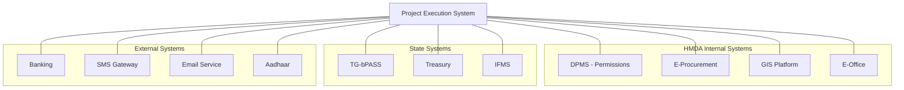
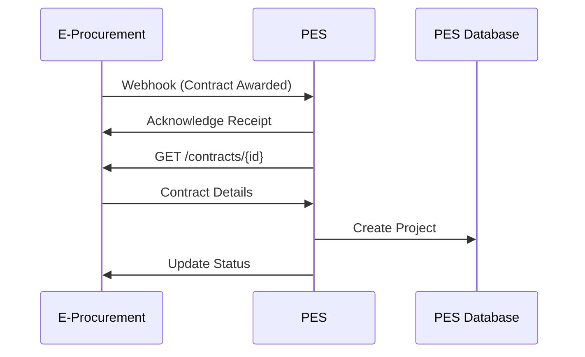
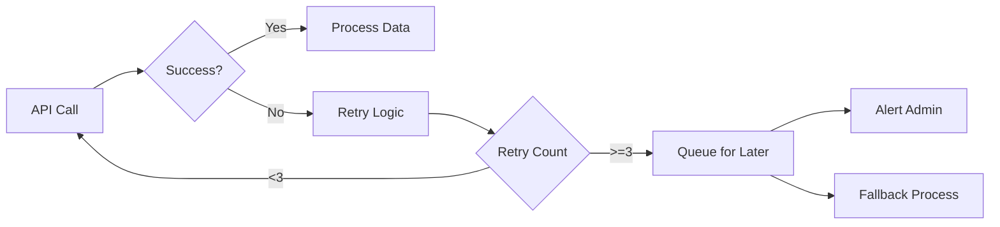
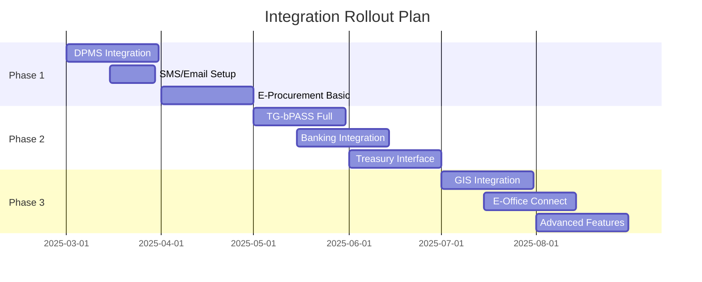

# Project Execution System - Integration Strategy

## Executive Summary

This integration strategy outlines how the HMDA Project Execution System (PES) will seamlessly connect with existing HMDA systems and external platforms. The strategy emphasizes API-first architecture, real-time data synchronization, and minimal disruption to ongoing operations.

## 1. Integration Landscape

### 1.1 Systems to Integrate



### 1.2 Integration Priority Matrix

| System | Priority | Integration Type | Data Flow | Timeline |
|--------|----------|-----------------|-----------|----------|
| DPMS | Critical | Real-time API | Bidirectional | Phase 1 |
| E-Procurement | Critical | Batch + Real-time | Unidirectional | Phase 1 |
| TG-bPASS | High | Real-time API | Bidirectional | Phase 1 |
| Treasury | High | Batch File | Bidirectional | Phase 2 |
| GIS Platform | Medium | Real-time API | Bidirectional | Phase 2 |
| Banking | High | Real-time API | Bidirectional | Phase 2 |
| SMS/Email | Medium | Real-time API | Unidirectional | Phase 1 |
| E-Office | Low | Batch | Unidirectional | Phase 3 |

## 2. Integration Architecture

### 2.1 High-Level Architecture

```
┌─────────────────────────────────────────────────────────────────┐
│                        Enterprise Service Bus (ESB)              │
├───────────┬──────────┬──────────┬──────────┬──────────┬────────┤
│  Adapter  │ Transform│  Route   │ Orchestr │ Monitor  │ Secure │
│  Layer    │  Engine  │  Engine  │  -ation  │  Service │ Gateway│
└───────────┴──────────┴──────────┴──────────┴──────────┴────────┘
                              │
            ┌─────────────────┼─────────────────┐
            │                 │                 │
    ┌───────▼────────┐ ┌─────▼──────┐ ┌───────▼────────┐
    │ Synchronous    │ │Asynchronous│ │ File-based     │
    │ Integration    │ │Integration │ │ Integration    │
    │ (REST/SOAP)    │ │(Queue/Event│ │ (SFTP/Batch)   │
    └────────────────┘ └────────────┘ └────────────────┘
```

### 2.2 Integration Patterns

#### 2.2.1 Request-Reply Pattern (Synchronous)
Used for: DPMS, TG-bPASS, Banking APIs
```
PES → API Gateway → Target System → Response → PES
```

#### 2.2.2 Publish-Subscribe Pattern (Asynchronous)
Used for: Notifications, Status Updates
```
PES → Message Queue → Subscribers (Multiple Systems)
```

#### 2.2.3 Batch Processing Pattern
Used for: Treasury, Large Data Transfers
```
PES → File Generation → SFTP → Target System → Acknowledgment
```

#### 2.2.4 Event Streaming Pattern
Used for: Real-time Updates, Audit Logs
```
PES → Event Stream → Stream Processor → Target Systems
```

## 3. System-Specific Integration Details

### 3.1 DPMS Integration

#### Integration Objectives
- Automatic project creation upon building permission approval
- Real-time status synchronization
- Document sharing between systems
- Unified user authentication

#### Technical Specification
```yaml
API Endpoint: https://dpms.hmda.gov.in/api/v2
Authentication: OAuth 2.0
Data Format: JSON
Rate Limit: 1000 requests/minute

Key APIs:
  - GET /permissions/{id} - Retrieve permission details
  - POST /permissions/{id}/status - Update permission status
  - GET /documents/{id} - Retrieve documents
  - POST /notifications - Send notifications
```

#### Data Mapping
| DPMS Field | PES Field | Transformation |
|------------|-----------|----------------|
| permission_id | external_ref_id | Direct mapping |
| applicant_name | project_owner | Direct mapping |
| building_type | project_category | Lookup table |
| approved_date | project_start_date | Date format conversion |
| approved_amount | estimated_cost | Currency formatting |

### 3.2 E-Procurement Integration

#### Integration Objectives
- Automatic import of awarded contracts
- Contractor details synchronization
- Performance feedback loop
- Payment milestone tracking

#### Technical Specification
```yaml
Primary: REST API
Backup: File-based integration
Endpoint: https://eprocurement.telangana.gov.in/hmda/api
Authentication: API Key + Digital Signature
Sync Frequency: Every 4 hours + Real-time webhooks

Key Operations:
  - Pull awarded contracts
  - Update contractor performance
  - Sync payment schedules
  - Export completion certificates
```

#### Integration Flow


### 3.3 TG-bPASS Integration

#### Integration Objectives
- Seamless permission tracking
- Automated compliance checks
- Timeline synchronization
- Document exchange

#### Technical Specification
```yaml
Environment: Production
Base URL: https://tgbpass.telangana.gov.in/api/hmda
Protocol: REST over HTTPS
Authentication: JWT with refresh tokens

Core Integrations:
  - Application status sync
  - Document upload/download
  - Timeline tracking
  - Compliance verification
```

### 3.4 Treasury Integration

#### Integration Objectives
- Automated payment processing
- Real-time payment status
- Reconciliation support
- Audit trail maintenance

#### File Specifications
```
Format: Fixed-width text file / XML
Encryption: PGP encryption
Transfer: SFTP with key authentication
Frequency: Daily batch at 6 PM
Reconciliation: Next day 10 AM

File Layout:
- Header Record (80 chars)
- Payment Records (150 chars each)
- Trailer Record (80 chars)
```

### 3.5 GIS Platform Integration

#### Integration Objectives
- Project location mapping
- Spatial analysis
- Asset georeferencing
- Progress visualization

#### API Specification
```javascript
// Sample GIS Integration
const gisClient = new GISClient({
  endpoint: 'https://gis.hmda.gov.in/api',
  apiKey: process.env.GIS_API_KEY
});

// Add project to map
await gisClient.addFeature({
  type: 'project',
  geometry: {
    type: 'Point',
    coordinates: [78.4867, 17.3850]
  },
  properties: {
    projectId: 'HMDA-2025-001',
    name: 'Road Development Project',
    status: 'In Progress'
  }
});
```

### 3.6 Banking Integration

#### Integration Objectives
- Online payment collection
- Automated reconciliation
- Real-time payment status
- Multi-bank support

#### Payment Gateway Specification
```yaml
Primary Gateway: SBI Payment Gateway
Backup Gateway: HDFC Payment Gateway
Protocol: REST API
Security: TLS 1.3 + API signing

Supported Operations:
  - Initiate payment
  - Check payment status
  - Refund processing
  - Settlement reports
  - Reconciliation files
```

## 4. Integration Security

### 4.1 Security Layers

| Layer | Security Measure | Implementation |
|-------|-----------------|----------------|
| Network | VPN/Private circuits | IPSec tunnels |
| Transport | TLS 1.3 | Certificate pinning |
| Message | Encryption + Signing | AES-256 + RSA |
| Application | API keys + OAuth | Token rotation |
| Data | Field encryption | Sensitive data only |

### 4.2 API Security Standards

```yaml
Authentication Methods:
  - OAuth 2.0 for user context
  - API Keys for system-to-system
  - mTLS for critical systems
  - JWT for stateless auth

Rate Limiting:
  - Default: 100 requests/minute
  - Authenticated: 1000 requests/minute
  - Burst: 2x normal rate for 1 minute

Security Headers:
  - X-Content-Type-Options: nosniff
  - X-Frame-Options: DENY
  - X-XSS-Protection: 1; mode=block
  - Strict-Transport-Security: max-age=31536000
```

## 5. Data Synchronization Strategy

### 5.1 Synchronization Patterns

| Pattern | Use Case | Frequency | Systems |
|---------|----------|-----------|----------|
| Real-time | Status updates | <1 second | DPMS, TG-bPASS |
| Near real-time | Transactions | <1 minute | Banking, SMS |
| Scheduled | Bulk data | Hourly/Daily | E-Procurement |
| Event-driven | Changes only | On occurrence | All systems |

### 5.2 Conflict Resolution

```
Priority Order:
1. PES (for project execution data)
2. DPMS (for permission data)
3. E-Procurement (for contract data)
4. External systems

Conflict Resolution:
- Timestamp-based (latest wins)
- Source system priority
- Manual intervention for critical conflicts
- Audit log for all resolutions
```

## 6. Error Handling and Recovery

### 6.1 Error Handling Strategy



### 6.2 Recovery Mechanisms

| Failure Type | Recovery Method | RTO |
|-------------|----------------|-----|
| API Timeout | Automatic retry with backoff | 30 seconds |
| Authentication | Token refresh | 1 minute |
| System Down | Queue and replay | 1 hour |
| Data Error | Manual intervention queue | 4 hours |

## 7. Performance Optimization

### 7.1 Caching Strategy

```yaml
Cache Levels:
  - API Gateway: 60 seconds for GET requests
  - Application: 5 minutes for reference data
  - Database: Query result cache
  
Cache Keys:
  - Include version in key
  - User context for personalized data
  - TTL based on data volatility
```

### 7.2 Batch Processing Optimization

| Operation | Batch Size | Frequency | Processing Time |
|-----------|------------|-----------|-----------------|
| Contract Import | 100 records | Every 4 hours | <5 minutes |
| Status Sync | 500 records | Every hour | <2 minutes |
| Payment Files | 1000 records | Daily | <10 minutes |

## 8. Monitoring and Observability

### 8.1 Integration Monitoring

```yaml
Metrics to Track:
  - API response time (p50, p95, p99)
  - Error rates by endpoint
  - Data synchronization lag
  - Queue depths
  - Retry counts

Alerting Thresholds:
  - Response time > 5 seconds
  - Error rate > 1%
  - Sync lag > 10 minutes
  - Queue depth > 1000
  - Failed retries > 10/minute
```

### 8.2 Integration Dashboard

```
┌─────────────────────────────────────────────────────────┐
│                Integration Health Dashboard              │
├─────────────┬────────┬────────┬────────┬───────────────┤
│   System    │ Status │ Latency│ Errors │ Last Sync     │
├─────────────┼────────┼────────┼────────┼───────────────┤
│ DPMS        │   ✅   │  120ms │  0.1%  │ 2 min ago     │
│ E-Procure   │   ✅   │  450ms │  0.0%  │ 1 hour ago    │
│ TG-bPASS    │   ✅   │  200ms │  0.2%  │ 5 min ago     │
│ Treasury    │   ✅   │   N/A  │  0.0%  │ 6 hours ago   │
│ Banking     │   ⚠️   │  850ms │  0.5%  │ 1 min ago     │
└─────────────┴────────┴────────┴────────┴───────────────┘
```

## 9. Testing Strategy

### 9.1 Integration Testing Phases

| Phase | Focus | Duration | Environment |
|-------|-------|----------|-------------|
| Unit Testing | API contracts | 2 weeks | Development |
| Integration Testing | End-to-end flows | 4 weeks | Staging |
| Performance Testing | Load and stress | 2 weeks | Pre-production |
| UAT | Business scenarios | 2 weeks | Production-like |

### 9.2 Test Scenarios

```gherkin
Feature: DPMS Integration
  Scenario: Project creation from approved permission
    Given a building permission is approved in DPMS
    When the approval webhook is received
    Then a new project should be created in PES
    And the project details should match the permission
    And a confirmation should be sent to DPMS

Feature: Payment Processing
  Scenario: Successful payment via Treasury
    Given a payment request is approved
    When the payment file is generated
    Then it should be encrypted and sent to Treasury
    And the acknowledgment should be processed
    And the payment status should be updated
```

## 10. Rollout Strategy

### 10.1 Phased Integration Rollout



### 10.2 Rollback Strategy

| Integration | Rollback Method | Time to Rollback |
|-------------|----------------|------------------|
| API-based | Feature toggle | <1 minute |
| File-based | Revert to manual | <30 minutes |
| Database | Point-in-time recovery | <1 hour |
| Full system | Blue-green deployment | <5 minutes |

## 11. Support and Maintenance

### 11.1 Integration Support Model

| Level | Responsibility | Response Time |
|-------|---------------|---------------|
| L1 | Basic connectivity issues | 15 minutes |
| L2 | Data mapping problems | 2 hours |
| L3 | Complex integration issues | 4 hours |
| Vendor | Third-party system issues | Per SLA |

### 11.2 Maintenance Windows

```yaml
Scheduled Maintenance:
  - Time: Sunday 2 AM - 6 AM IST
  - Frequency: Monthly
  - Notification: 1 week advance
  
Emergency Maintenance:
  - Notification: 2 hours minimum
  - Approval: Change Advisory Board
  - Rollback ready: Always
```

## 12. Success Metrics

### 12.1 Integration KPIs

| Metric | Target | Current | Goal |
|--------|--------|---------|------|
| System Availability | 99.9% | N/A | ✓ |
| API Response Time | <500ms | N/A | ✓ |
| Data Sync Accuracy | 99.99% | N/A | ✓ |
| Integration Errors | <0.1% | N/A | ✓ |
| Manual Interventions | <5/day | N/A | ✓ |

### 12.2 Business Value Metrics

1. **Time Savings**: 80% reduction in data entry
2. **Error Reduction**: 95% fewer data discrepancies
3. **Process Efficiency**: 60% faster project initiation
4. **User Satisfaction**: Target 4.5/5 rating

## Conclusion

This integration strategy provides a comprehensive roadmap for connecting PES with the existing HMDA ecosystem. The phased approach ensures minimal disruption while delivering immediate value through critical integrations. Success depends on strong governance, robust testing, and continuous monitoring of integration health.

---

**Document Owner**: Integration Architecture Team  
**Last Updated**: January 2025  
**Review Cycle**: Quarterly

*This strategy will be updated based on lessons learned during implementation and changes in the integration landscape.*